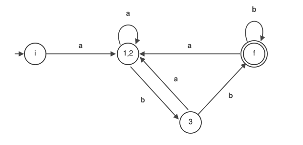

# オートマトン — 正規表現がどう動くのか

[English](README.md)


正規表現はあらゆる場面で使われている。
しかし「中で何が起きているのか」となると、オートマトンというやや専門的な理論が顔を出す。

<!-- SEO intro added by setup-github-pages; review and adjust -->

「**正規表現エンジンの仕組み**を中まで知りたい」「**NFA** と **DFA** がどう繋がっているのか腑に落ちない」「**Thompson 構成**・**部分集合構成**・**状態数最小化** を、小さくても本物の例で一度通してみたい」 ── そんな人のための教材です。どの手順もまず状態遷移図と手計算で追い、そのまま外部ライブラリなしの **Python** 実装まで繋げます。扱うテーマは **ε 閉包**、**遷移表**、**再帰下降構文解析**、そして後戻りなしの一致判定。

<!-- /SEO intro -->

そこでここでは、正規表現を思い切り小さなサブセットに絞り、
それを処理するツールを最もシンプルな形で実装する。
扱うのは**連接・選択 `|`・繰り返し `*`・省略 `?` の 4 つだけ**（と、優先順位を変える括弧）。
`+` も `.` も文字クラスもアンカーも無い。

記法を削った分、**正規表現 → NFA → DFA → 最小化 → 一致判定**という
正規表現エンジンの背骨が、寄り道なしで 1 本に繋がる。

このうち最初の 3 つは、実は理論上の正規表現の定義に出てくる演算そのものである。
`+` も `[abc]` も `{2,3}` も、この 3 つに書き換えられる略記に過ぎない。
だからサブセットとはいえ、正規表現が動く仕組みの本質はここで掴める。
4 つめの `?` は [05 章](docs/ja/05-subset.md) で導入する。
規則を 1 つ足すだけで扱える記法が増える、という実演を兼ねている。



たとえば `a(a|b)*bb` は、最後にはこの 4 つの状態を持つ機械になる。
丸が状態、矢印が「その文字を読んだら次はここ」。
ここまで持ち込めれば、文字列が一致するかどうかは
**先頭から 1 文字読むごとに矢印を 1 本たどる**だけで決まる。
候補を試しては戻る、ということをしない。

## 読む

| 章 | 内容 |
| --- | --- |
| [01. オートマトンとは](docs/ja/01-automaton.md) | 状態と遷移だけでできた機械。例 `a(a\|b)*bb` と、その非決定性有限オートマトン (NFA) |
| [02. 正規表現から NFA を作る](docs/ja/02-regex-to-nfa.md) | 4 つの規則で NFA を組み立てる。そして、できた NFA の何が困るのか |
| [03. NFA を DFA に変換する](docs/ja/03-nfa-to-dfa.md) | ε 遷移の消去と部分集合構成。決定性有限オートマトン (DFA) の定義 |
| [04. 状態数を最小化する](docs/ja/04-minimize.md) | 区別のつかない状態をまとめて、5 状態を 4 状態にする |
| [05. 扱う正規表現を決める](docs/ja/05-subset.md) | ここから実装編。連接・`\|`・`( )`・`*`・`?` だけの範囲なら何でも扱えるようにする |
| [06. パターンを読んで NFA にする](docs/ja/06-parse-nfa.md) | パターンの構造を取り出し、5 つの規則を当てはめる |
| [07. DFA にして判定する](docs/ja/07-dfa-match.md) | 部分集合構成・最小化・一致判定を通し、コマンドにする |

01〜04 章にコードは出てこない。理屈を図と手計算で示すことに徹している。
05〜07 章が実装編で、そこで初めてコードが出てくる。

想定読者は「正規表現は使えるが、正規表現エンジンが内部で何をしているかは知らない」人。

## 動かす

05〜07 章で作るツールは、このリポジトリで今すぐ動く。
Python 3.6 以上なら、外部ライブラリは要らない。

```
$ python3 -m automaton 'a(a|b)*bb' abb ab aabb ababb bb
match     'abb'
no match  'ab'
match     'aabb'
match     'ababb'
no match  'bb'
```

テキストを渡さなければ標準入力を読むので、grep のようにも使える。

```
$ printf 'abb\nab\naabb\nxyz\nababb\n' | python3 -m automaton 'a(a|b)*bb'
abb
aabb
ababb
```

扱えるのは `|`（選択）、`( )`（括弧）、`*`（繰り返し）、`?`（省略）、文字の連接だけ。
`+` も `.` も文字クラスもアンカーも無い。判定は文字列全体の一致で、部分一致の検索はしない。

## 構成

```
automaton/          実装。正規表現 → NFA → DFA → 最小化 → 一致判定
├── regex.py        パターンを読んで構造を取り出す
├── nfa.py          5 つの規則で NFA を組み立てる
├── dfa.py          ε 閉包 / 部分集合構成 / 最小化 / 一致判定
└── __main__.py     コマンドラインの入口
docs/ja/            解説（日本語）。図は手書きの SVG
docs/en/            その英訳。図は docs/ja/img/ を共有する
tests/              各段階が解説の図表と一致すること、re と同じ判定になることを確認
```

テストは `pytest` で走る。

```
$ python3 -m pytest tests -q
```

素の `assert` で書いてあるので、pytest が入っていない環境ではファイルを直接実行してもよい。
どちらでも同じ検査が走る。

```
$ python3 tests/test_pipeline.py
ok test_nfa_matches_the_figure
ok test_subset_construction_matches_the_figure
ok test_minimized_dfa_matches_the_figure
ok test_same_answers_as_the_regex_module
ok test_other_patterns
ok test_patterns_with_an_epsilon_cycle
ok test_bad_patterns_raise_value_error
```


## クレジット

- 企画: t-ishii66(大学で物理を学ぶ。システムエンジニア。英会話奮闘中)
- ベースドキュメント: t-ishii66
- ドキュメント: Claude Opus 5
- コーディング: Claude Opus 5
- ドキュメントレビュー: t-ishii66
- コードレビュー: t-ishii66
- イラスト: Codex GPT6
- バージョン: 1.0.0

