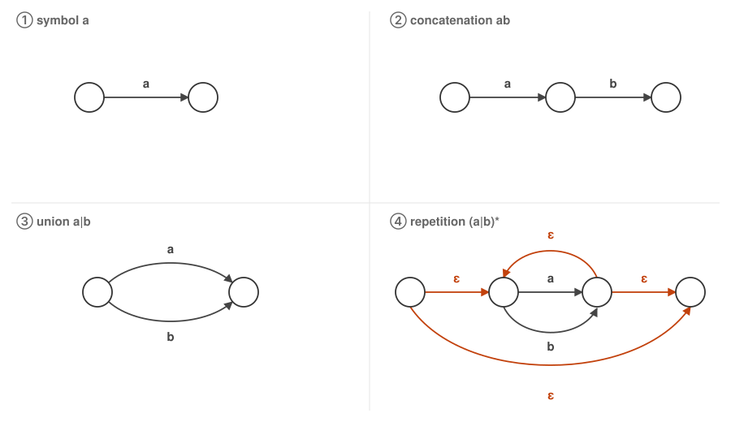
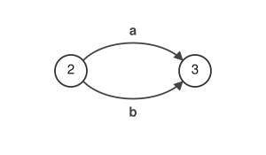
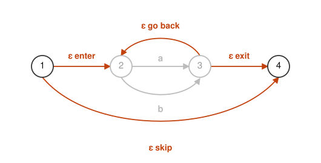
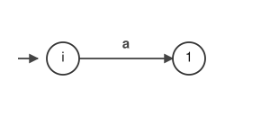
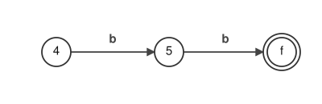

# 02. Building an NFA from a Regular Expression


The NFA we saw in [Chapter 01](01-automaton.md) was handed to us out of thin air.
But it can be built mechanically from the regular expression. There are only 4 construction rules.



An arrow with a symbol on it means moving after reading one character of input; an ε arrow means being able to move without reading input.
Every circle is a state.

The figure is drawn with `a` and `b`, but in the positions of these `a` and `b`
a part of the regular expression may go in as a lump.
In fact ④ is a drawing of `(a|b)*`, and the two circles in the middle together with the `a` and `b` that join them are ③ itself.
In other words, the 4 rules amount to a procedure for **making a slightly larger NFA out of smaller NFAs as parts**.

| Rule | What to do |
| --- | --- |
| ① symbol `a` | Make 2 states and draw one `a` transition between them |
| ② concatenation `ab` | Use the end state of `a` as it is for the start state of `b` |
| ③ union `a\|b` | Draw the 2 arrows `a` and `b` from the same state, and bring their destinations together into a single state |
| ④ repetition `(a\|b)*` | Place states before and after the repeated part `a\|b`, and draw 4 ε arrows as in the figure |

The 4 ε arrows of ④ correspond to `1→2`, `1→4`, `3→2` and `3→4` in the NFA of Chapter 01.
What each of these 4 arrows does is something we will see later, when we assemble the machine.
④ is the only rule that uses ε; ② and ③ get by with nothing more than bringing states together.

The regular expressions we handle here are taken to be the ones that can be assembled out of just these 4 rules.
That said, a 5th rule is added in [Chapter 05](05-subset.md). It is `?` (0 times or 1 time), and
it too can be added in the same way. It does not appear in `a(a|b)*bb`, so we will not use it from here on.

> In Thompson's construction, the union of ③ also gets 2 new states with 4 ε arrows drawn, so
> the number of states grows further. ①, ② and ④ have the same shape as in Thompson.
> The reason only ③ places no states, letting both branches leave the same state and bringing their destinations together,
> is to make it agree with the figure in Chapter 01. Either way, the set of strings accepted does not change.

## Building `a(a|b)*bb`

`a(a|b)*bb` is the concatenation of the 4 items `a`, `(a|b)*`, `b` and `b`.
Of these, `(a|b)*` is a repetition of `(a|b)`, and `(a|b)` is a union of `a` and `b`.
We apply the rules in order, starting from the innermost part.

The names of the states are assigned in advance so as to match the figure that will come out.

### Step 1: Apply ③ to `a|b`

Prepare 2 states, and from one to the other draw the 2 arrows `a` and `b`. This is figure ③ itself.
We call these 2 states `2` and `3`.



With either `a` or `b`, one character is read and we move from `2` to `3`. This is the shape of "union".

### Step 2: Apply ④ to `(a|b)*`

The part made in step 1 (the `a|b` portion) is the **body** that gets repeated.
Add one state before it and one after it, calling the front one `1` and the back one `4`. Then draw 4 ε arrows.



Grey is the body made in step 1. Each of the 4 orange arrows is in charge of
**entering** the body, **skipping** the body (the 0-times case),
**going back** from the end of the body (repeating once more), and **exiting** the body.

The meaning "0 or more repetitions" shows up in these 4 arrows just as it is.
For 0 times, use "skip"; for once, "enter" → body → "exit"; for twice or more, use "go back" along the way.

With this, the part corresponding to `(a|b)*` is done. Its beginning is `1` and its end is `4`.

### Step 3: Make the leading `a` with ①, and join it with ②

With ①, make 2 states and draw one `a` transition.
Then **make its end state the same state as `1`, the beginning of the part from step 2**. This is the concatenation of ②.
The beginning state that is left over is the start state of the whole thing, so we call it `i`.



### Step 4: Join the remaining `b`, `b` with ②

In the same way, take `4`, the end of the part from step 2, as a beginning, draw a `b` transition, and go to a new state `5`.
Then from `5` go by `b` to `f`. This last `f` is the accepting state of the whole thing.



### The Finished Product

The transitions drawn come to 9 in total.

```
(i)-- a -->(1)        step 3
(1)-- ε -->(2)        "enter" from step 2
(1)-- ε -->(4)        "skip" from step 2
(2)-- a -->(3)        the union from step 1
(2)-- b -->(3)        the union from step 1
(3)-- ε -->(2)        "go back" from step 2
(3)-- ε -->(4)        "exit" from step 2
(4)-- b -->(5)        step 4
(5)-- b -->((f))      step 4
```

Drawn as a figure, it is the very NFA presented in Chapter 01.


The state names `i, 1, 2, ..., f` were assigned in the order in which the edges are followed from the start state.

In other words, the NFA of Chapter 01 is the result of applying these 4 rules to `a(a|b)*bb`.
As long as you have a regular expression, an NFA can always be built.

## The Problem with This NFA

The NFA built this way has 4 ε transitions: `1→2`, `1→4`, `3→2` and `3→4`.
This becomes a nuisance, just as it is, when we run the machine.
Let us feed in `abb` and follow along in order from `i`.

```
i --a--> 1    a single path up to here
1 --ε--> 2 or 4?   it splits into 2 moves without reading input
```

If we choose `4`, we read `b`, `b`, arrive at `f`, and can accept.
If we choose `2`, we read `b` and advance to `3`, and from there it splits again into `2` or `4`.

Because the branching happens regardless of where in the input we are reading,
**which one is correct cannot be known on the spot**. It can only be known after reading all the way to the end.
Implemented naively, we try one and if it fails go back to the other — backtracking is required.
The branches also nest, so as the input gets longer the combinations to try increase sharply.

What we want is a machine in which **the destination is settled on exactly one from the state we are in now and the next single character**.
Then there is no way for it to branch, and it is enough to trace the input once from the top.

So then, **how can we remove the ε transitions and get into that form?**
That is the subject of [Chapter 03](03-nfa-to-dfa.md).
