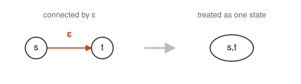

# 03. Converting an NFA into a DFA


We answer the question left open at the end of [Chapter 02](02-regex-to-nfa.md).
Because of the ε transitions, when we were in state `1` it was not settled whether the next one was `2` or `4`.

## Deterministic Finite Automata (DFA)

What we want is a finite automaton in which **once the state we are in now and the next single character are settled,
the destination state is settled on exactly one**. This is called a **deterministic finite automaton (DFA)**.

There are only 2 causes for the destination not being settled, so the conditions can be written as follows.

1. There is not a single ε arrow
2. From any one state, there are not 2 or more arrows with the same symbol

If there is an ε arrow, the machine moves on to the next state without reading input.
If there are 2 arrows with the same symbol, then even after reading one character the destination cannot be narrowed down to one.
If neither is present, there is no room to hesitate, and simply tracing the input once, one character at a time from the beginning,
settles whether it is accepted or not accepted. Neither backtracking nor searching is required.

The NFA we built in [Chapter 02](02-regex-to-nfa.md) satisfies (2) but does not satisfy (1).
So what has to be removed is only the ε transitions.

## The Idea

The idea is simple: **if we do not know which one it is, we make it be in both**.
It is enough to make a single state meaning "in both `2` and `4`".
That is, **we take one state of the DFA to be a set of states of the NFA**.
This way no branching occurs, and there is no need to try and go back.

## Eliminating ε Transitions



If we can go from `(s)` to `(t)` by ε, then when we are in `(s)` we may as well think we are in `(t)` too.
Since we can move without reading input, there is no point in distinguishing which of the two we are in.
So we bring both together and consider it as having transitioned to a single state `(s,t)`.

This "everything that can be reached by ε alone, all collected together" is called the **ε closure**.
In the NFA of 01, from `1` we can go by ε to `2` and `4`, so it comes out as follows.


The start state of the DFA is `(i)` (since no ε transition leaves `i`, it is just `i` alone).

## Finding the Transitions from a Set

Next, consider the destination when `a` is input from state `(1,2,4)`.
It is enough to check each element of the set and take the union.

| Source state | Destination by `a` |
| --- | --- |
| 1 | none |
| 2 | 3 |
| 4 | none |

There is only the transition to `(3)`, but since there are ε transitions from `3` to `2` and `4`,
in the end the transition from state `(1,2,4)` by `a` becomes `(2,3,4)`.


Next, consider the transition when `b` is input from `(1,2,4)`.

| Source state | Destination by `b` |
| --- | --- |
| 1 | none |
| 2 | 3 |
| 4 | 5 |

And in the case of `3` there are the ε transitions to `2` and `4`, so in the end it becomes `(2,3,4,5)`.

We repeat this until no new sets come out.

## The DFA We Obtained

The sets that came out number 5 in total, and the transitions are as follows.

| DFA state | Destination by `a` | Destination by `b` |
| --- | --- | --- |
| `(i)` | `(1,2,4)` | none |
| `(1,2,4)` | `(2,3,4)` | `(2,3,4,5)` |
| `(2,3,4)` | `(2,3,4)` | `(2,3,4,5)` |
| `(2,3,4,5)` | `(2,3,4)` | `(2,3,4,5,f)` |
| `(2,3,4,5,f)` | `(2,3,4)` | `(2,3,4,5,f)` |

The state that contains the final state `((f))` is `((2,3,4,5,f))`, and it becomes the end state in the DFA.

Drawn as a figure, it comes out as follows.


The ε transitions are gone, and there is no going to 2 places from one state on the same symbol.
That is, it satisfies both of the 2 DFA conditions.

Note that the start state `i` has no destination by `b`.
Since a string beginning with anything other than `a` has no way of matching this regular expression, this is correct.
It also means that it is fine for the transition table to have holes in it.

## What We Have Gained

The branching we saw in [Chapter 02](02-regex-to-nfa.md) is gone.
Tracing `abb`, this time there is nowhere to hesitate.

```
i --a--> (1,2,4) --b--> (2,3,4,5) --b--> (2,3,4,5,f)
```

The `(2,3,4,5,f)` we arrive at last contains `f`, so it is an accepting state. It is settled that `abb` matches.
We read once, with no backtracking.

Please note that once the original regular expression

```
a(a|b)*bb
```

takes the form of a DFA, **whether any given input text matches the regular expression or not can be decided easily**.
This is what regular expression engines and lexical analyzers are doing internally.

## How to Build a DFA

> **Procedure for building a DFA from an NFA**
>
> 1. Take the start state of the NFA together with every state reachable from that start state by ε transitions, all brought together, as the start state of the DFA.
> 2. The transition from a DFA state (a set of states in the NFA) is the union of the transitions from the elements of that NFA set, taken as one DFA state.
> 3. Repeat the above 2 until no new set (i.e. no new DFA state) is obtained.

There are 5 states. In the next [Chapter 04](04-minimize.md), we reduce these to 4.
