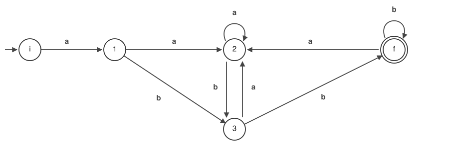

# 04. Minimizing the Number of States

The DFA we obtained in [Chapter 03](03-nfa-to-dfa.md) had 5 states.
Among these, states for which "no matter how the input continues, the accept / not-accept result does not change" are meaningless to distinguish.
If we bring them together, the number of states goes down.

## First, Shorten the Names

Left as sets they are hard to read, so we rewrite the DFA as follows.

| Before rewriting | After rewriting |
| --- | --- |
| `(i)` | `i` |
| `(1,2,4)` | `1` |
| `(2,3,4)` | `2` |
| `(2,3,4,5)` | `3` |
| `(2,3,4,5,f)` | `f` |

**From here on, `1`, `2` and `3` are the names of DFA states, not states of the NFA.**
They have nothing to do with the `1`, `2` and `3` that appeared in Chapters 02 and 03, so take care.

The transition table comes out as follows.

| State | Destination by `a` | Destination by `b` |
| --- | --- | --- |
| `i` | `1` | none |
| `1` | `2` | `3` |
| `2` | `2` | `3` |
| `3` | `2` | `f` |
| `f` | `2` | `f` |

We notice that the rows for `1` and `2` are the same. This is the clue for minimization.

## The Procedure

> **Algorithm for minimizing the number of states**
>
> 1. Divide the states of the DFA into 2 sets: the set consisting of the final states, and the set of the rest
> 2. Split each set according to the kinds of transitions it has.
> 3. Split each set according to which set the destinations of its transitions belong to.
> 4. Repeat the above 3, and when no set can be split any further, stop.

We start from the position that "whatever remains in the same set cannot be distinguished",
and split things apart each time a difference is found. When nothing can be split any more, the sets that remain are the states after minimization.

### Following It by Hand

Applying this to the transition table above, it finishes in 3 moves.

| Step | What to do | How it splits |
| --- | --- | --- |
| (1) | Divide into the final states and the rest | `{f}` / `{i,1,2,3}` |
| (2) | Split by the kinds of transitions | `{f}` / `{i}` / `{1,2,3}` |
| (3) | Split by the set the destinations belong to | `{f}` / `{i}` / `{1,2}` / `{3}` |
| (4) | It cannot be split any more | Stop |

The reason `i` drops out at (2) is that `i` alone has no destination by `b`.

The reason `3` drops out at (3) is that **the set its destination belongs to** for `b` is different.
The destination of `1` and `2` for `b` is `3`, which is inside the same `{1,2,3}` as they are.
The destination of `3` for `b` is `f`, and this one is a different set, `{f}`.
The destination for `a` is `2` for all 3 of them, that is, inside the same `{1,2,3}`, so no difference shows up here.

What we compare is not the destination states themselves.
Since states in the same set have not been distinguished yet,
even if the destinations are different states, if those two are in the same set then the destinations cannot be distinguished either.
In this example comparing by state gives the same answer, but in general it does not.

What remains is 4. `1` and `2` never got split apart to the end.

## The Minimized DFA

The 4 sets that remain become, just as they are, the states of the minimized DFA.
`1` and `2` are brought together into a single state called `1,2`.

| State | Destination by `a` | Destination by `b` |
| --- | --- | --- |
| `i` | `1,2` | none |
| `1,2` | `1,2` | `3` |
| `3` | `1,2` | `f` |
| `f` (final state) | `1,2` | `f` |

5 states became 4 states. Drawn as a figure, it comes out as follows.

This too still satisfies the 2 DFA conditions from [Chapter 03](03-nfa-to-dfa.md):
`(1)` there is no ε arrow, `(2)` from any one circle there are not 2 or more arrows with the same symbol.

## Deciding a Match

As we saw in [Chapter 03](03-nfa-to-dfa.md), all that is left is to look up the transition table one character at a time.
Let us decide `ababb`.

| Character read | Current state |
| --- | --- |
| (at the start) | `i` |
| `a` | `1,2` |
| `b` | `3` |
| `a` | `1,2` |
| `b` | `3` |
| `b` | `f` |

When we have finished reading we are in `f`, so it is accepted. `ababb` matches `a(a|b)*bb`.

With `ab`, at the point where reading ends we are in `3`, so it is not accepted.
With `bb`, at the first `b` there is nowhere to go from `i`, so it is settled as not accepted on the spot.

In every case, it was enough to trace the input once, one character at a time.

## Summary

| Chapter | Input | Output | Number of states |
| --- | --- | --- | --- |
| [Chapter 02](02-regex-to-nfa.md) | the regular expression `a(a\|b)*bb` | NFA | 7 |
| [Chapter 03](03-nfa-to-dfa.md) | NFA | DFA | 5 |
| Chapter 04 | DFA | minimized DFA | 4 |

Starting from a regular expression, we have arrived at the form "just look up a table, one character at a time", using nothing but mechanical procedures.
There is not a single place along the way where human ingenuity is required.

Up to here we have followed the procedure with one example, `a(a|b)*bb`.
From [Chapter 05](05-subset.md) on, we make the same procedure into **a form that works for any pattern**.
Any regular expression that can be written with concatenation, `|`, `( )` and `*`, plus the `?` foreshadowed in Chapter 02 —
for any of them, internally build an NFA, turn it into a DFA, and decide the match. That is what we will assemble as an implementation.
