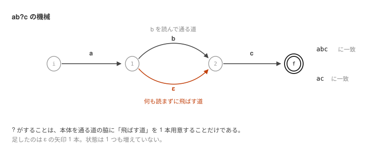

# 05. Deciding Which Regular Expressions We Handle


In [Chapter 01](01-automaton.md) through [Chapter 04](04-minimize.md) we saw the procedure from NFA to DFA
with one example, `a(a|b)*bb`. Naturally, the next thing one wonders is "can the same thing be done with other patterns too?"

It can. What is more, a human does not have to draw the figures; the machine only has to walk through the same procedure.
From here on, we build that as a script that actually runs.

## The Range We Handle

What we dealt with in [Chapter 01](01-automaton.md) through [Chapter 04](04-minimize.md) were regular expressions
that can be assembled out of just the following 3 things.

| Operation | Meaning | How to write it | Strings it matches |
| --- | --- | --- | --- |
| concatenation | line them up | `abb` | `abb` |
| union `\|` | one or the other | `a\|b` | `a`, `b` |
| repetition `*` | 0 or more times | `ab*` | `a`, `ab`, `abb`, … |

To these are added parentheses `( )` for changing precedence (as in `(a|b)*`).
Parentheses are not an operation; they are a notation showing how far one grouping extends.

These 3 are, in fact, **the very operations that appear in the theoretical definition of a regular expression**.
Much of the notation we use day to day is no more than shorthand that can be rewritten into these.

| Commonly used notation | Written with these 3 |
| --- | --- |
| `a+` (1 or more times) | `aa*` |
| `[abc]` (any one of these characters) | `(a\|b\|c)` |
| `a{2,3}` (2 to 3 times) | `aa\|aaa` |

## One More: Adding `?`

There is one thing that cannot be written with a combination of the 3 above: `a?` (0 times or 1 time).
This amounts to "`a` or **nothing at all**", that is, a union with the empty string ε, `a|ε`, but
we have not provided a notation here for writing ε. So instead we add `a?`.
This is what was touched on in [Chapter 02](02-regex-to-nfa.md) as "it can be added as ⑤".

| Operation | Meaning | How to write it | Strings it matches |
| --- | --- | --- | --- |
| optional `?` | 0 times or 1 time | `ab?c` | `ac`, `abc` |

It is enough to add, as a 5th to the 4 rules we saw in [Chapter 02](02-regex-to-nfa.md),
"make the body, and draw one ε from its entrance to its exit".



Going through the `b` arrow gives `abc`; skipping it with the ε arrow gives `ac`.
Whichever road we take we arrive at `2`, so everything beyond that is the same.
Whereas repetition `*` draws 4 ε arrows, `?` draws only the single "skip" one —
since there is no road back, the body is traversed at most once. We will see the details in [Chapter 06](06-parse-nfa.md).

And **nothing else changes at all**.
Since only one more ε transition is added, the subset construction of [Chapter 03](03-nfa-to-dfa.md) absorbs it as it is.
Neither the DFA conversion, nor the minimization, nor the match decision needs rewriting.

Adding just one rule increases the notation we can handle — this fact shows
that the procedure we saw in Chapters 01 through 04 is **not a stopgap**.

## What We Do Not Handle

There is no `.` (any single character), no character class `[ ]`, no count specifier `{n,m}`, and no anchor `^` or `$`.
As for back references (`\1`), they cannot be expressed by a DFA even in principle.

Characters other than `(`, `)`, `|`, `*` and `?` are all treated, just as they are, as single-character symbols.
The empty pattern (`''`) and empty parentheses (`()`) are not accepted.

And **any pattern within this range can be processed by the same procedure, whichever one comes along**.
Nothing special is done for the sake of `a(a|b)*bb`.
Read the pattern, build an NFA, turn it into a DFA, reduce the number of states, look up the table. That is all.

## The Overall Flow


The procedure we saw in Chapters 01 through 04 becomes, one at a time, exactly one part each.

| Stage | Chapter where we saw the theory | Chapter where we see the implementation |
| --- | --- | --- |
| Read the pattern | — | [Chapter 06](06-parse-nfa.md) |
| Build the NFA | [Chapter 02](02-regex-to-nfa.md) | [Chapter 06](06-parse-nfa.md) |
| Turn it into a DFA | [Chapter 03](03-nfa-to-dfa.md) | [Chapter 07](07-dfa-match.md) |
| Minimize the number of states | [Chapter 04](04-minimize.md) | [Chapter 07](07-dfa-match.md) |
| Decide the match | [Chapter 04](04-minimize.md) | [Chapter 07](07-dfa-match.md) |

"Read the pattern" is the only one with no corresponding chapter in 01 through 04.
There, a human took in the structure of the regular expression by eye, so there was no need to explain it.
Once we have a machine do it, that too has to be made into a procedure.

The language is Python. With 3.6 or later, it runs with the standard library alone.

## Let's Run It First

Here is what gets built. Hand it a pattern and some text, and it answers whether they match.

```
$ python3 -m automaton 'a(a|b)*bb' abb ab aabb ababb bb
match     'abb'
no match  'ab'
match     'aabb'
match     'ababb'
no match  'bb'
```

The decision is a match of the **whole** string; it does not search for partial matches.

## Can It Really Handle All of Them?

To be able to say flatly "anything within this range", grounds are needed.
In `tests/`, for a number of patterns we exhaustively enumerate short strings
and confirm that the decision comes out the same as Python's `re`.
For `a(a|b)*bb` it is all strings of length 7 or less;
for `a?`, `ab?`, `(a|b)?c`, `(a?b)*` and others besides, it is all strings of length 5 or less.

Furthermore, for 400 patterns made by randomly combining the 4 operations
(119 of which contain `?`),
we collated against `re` over all strings of length 5 or less (sequences of `a`, `b` and `c`),
and confirmed that not a single discrepancy comes out.

Then let us build it, in order, from [Chapter 06](06-parse-nfa.md) on.
