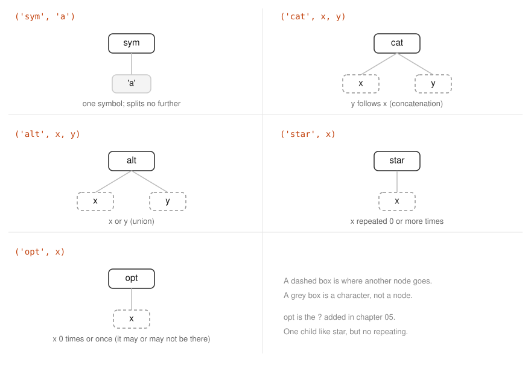
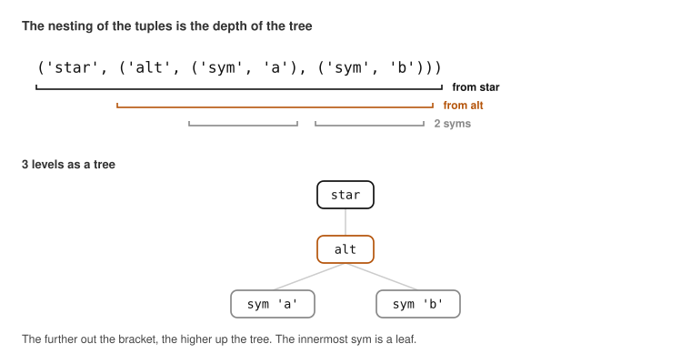
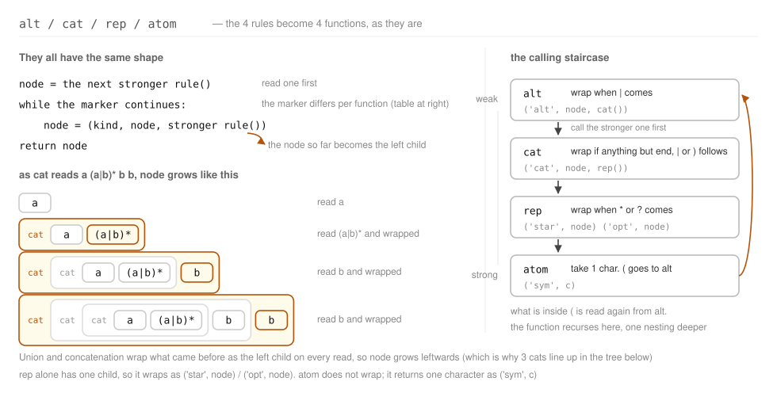
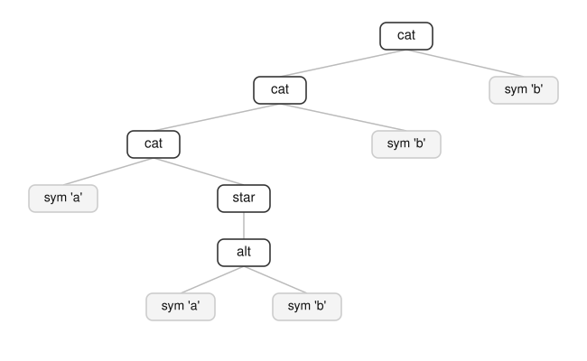
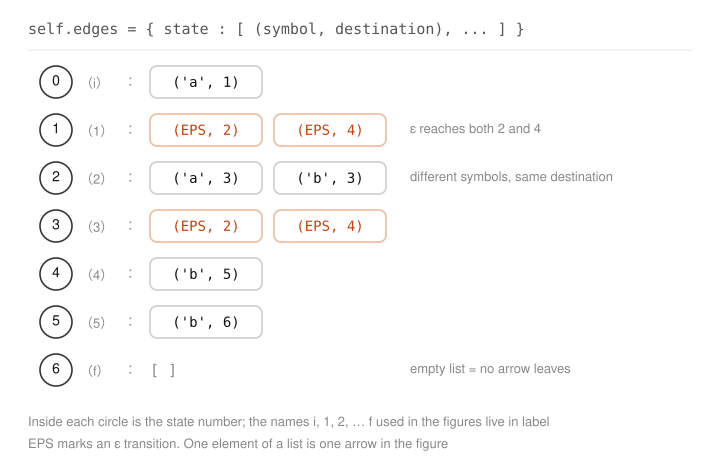
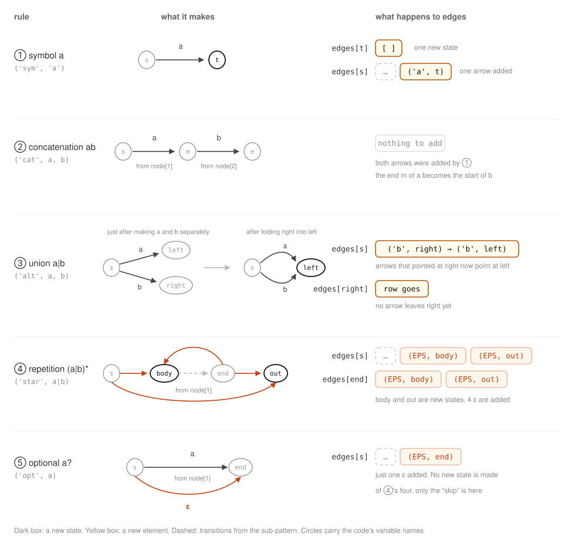
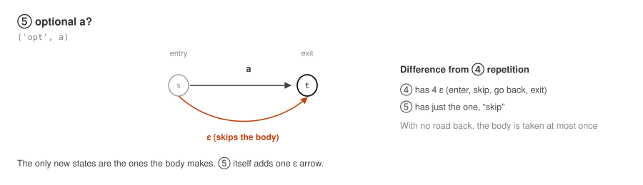
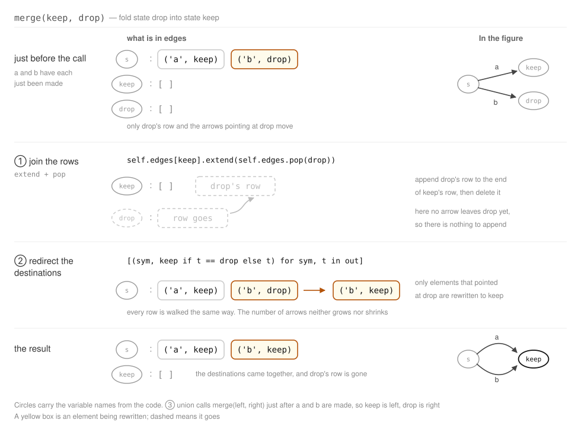

# 06. Reading a Pattern and Turning It into an NFA


We build everything up to taking a regular expression within the range decided in [Chapter 05](05-subset.md) and turning it into an NFA.
There are 2 things to do: reading the pattern and extracting its structure, and
applying the 4 rules of [Chapter 02](02-regex-to-nfa.md) (plus the 5th one added in [Chapter 05](05-subset.md)).

## 1. Reading the Pattern

In the main part we had a human take in the structure of `a(a|b)*bb` by eye, but
if we are making a tool, this too has to be done by a machine.

The operators of a regular expression have a **binding strength**, and in order from strongest they are
`*` (repetition), concatenation, and `|` (union).
For example, `a|bb*` is a union of `a` and `bb*`, not `(a|b)b*`.

So we write them down as 4 stages of rules, starting from the weakest operator.

```
alt  -> cat { '|' cat }      union         : concatenations lined up with |
cat  -> rep { rep }          concatenation : repetitions lined up
rep  -> atom { '*' | '?' }   repetition    : an element with * or ? attached
atom -> '(' alt ')' | CHAR   element       : a union enclosed in parentheses, or a single character
```

`->` means "the left-hand side has this shape", and `{ }` represents a repetition of 0 or more times.
The quoted `'|'`, `'*'`, `'?'` and `'('` are the very characters that appear in the regular expression, and
the unquoted `|` (in the `rep` and `atom` lines) is the "or" on the rule side.

Because a weaker rule is written so as to call a stronger rule, reading from the top in order
gets the nesting out exactly according to the binding strength.
The reason `atom` goes back to `alt` is for the parentheses, and this is where the nesting goes one level deeper.

The pattern string is looked at one character at a time from the beginning.
What holds that reading position is `_Parser`, and it has only 2 operations.

```python
class _Parser:
    def __init__(self, pattern):
        self.s = pattern
        self.i = 0

    def peek(self):
        return self.s[self.i] if self.i < len(self.s) else None

    def take(self):
        c = self.peek()
        if c is None:
            raise ValueError("unexpected end of pattern")
        self.i += 1
        return c
```

`peek()` only **looks at** the character at the current position; it does not move the position.
`take()` returns the character at the current position and advances the position by one. That is, it reads one character forward.
Once it comes to the end, `peek()` returns `None`, so the rule side knows from that that it is over.

What is being read here is **the characters of the pattern**, not the text being matched against.
Reading the text one character at a time is the match decision that comes later (section 5 of [Chapter 07](07-dfa-match.md)).

### What the Rules Produce — node

What the rules produce is a small tuple we call a **node**,
whose head is the name of the kind and whose rest are the children. There are only 5 kinds.



In the place of a child, another node goes in. That is why a node is a tree.



The depth of the parentheses becomes, just as it is, the number of levels of the tree.
The outermost `star` is the root, its child is `alt`, and its children in turn, the 2 `sym`s, are the leaves.

### Turning the Rules into Functions

The 4 rules of the grammar become, just as they are, 4 functions. Every one of them returns a node.

```python
    def alt(self):
        node = self.cat()
        while self.peek() == "|":
            self.take()
            node = ("alt", node, self.cat())
        return node

    def cat(self):
        node = self.rep()
        while self.peek() not in (None, "|", ")"):
            node = ("cat", node, self.rep())
        return node

    def rep(self):
        node = self.atom()
        while self.peek() in ("*", "?"):
            node = ("star" if self.take() == "*" else "opt", node)
        return node

    def atom(self):
        c = self.take()
        if c == "(":
            node = self.alt()
            if self.peek() != ")":
                raise ValueError("')' expected")
            self.take()
            return node
        if c in "|*?)":
            raise ValueError(f"unexpected {c!r}")
        return ("sym", c)
```

`alt`, `cat` and `rep` all have the same shape. First they call the rule one level stronger once, and then,
as long as the marker keeps coming, they **take the node so far as the left child and wrap it up again**.



Because `atom` calls `alt` back again, the functions recurse too.
This way of reading is called **recursive descent parsing**.

### The Result of Reading

Actually having it read `a(a|b)*bb` gives this.

```python
>>> from automaton.regex import parse
>>> parse("a(a|b)*bb")
('cat', ('cat', ('cat', ('sym', 'a'), ('star', ('alt', ('sym', 'a'), ('sym', 'b')))), ('sym', 'b')), ('sym', 'b'))
```

The parentheses are deep and it is hard to read, but drawn as a tree it has a straightforward shape.



The reason 3 `cat`s are lined up extending to the left is that the concatenation of the 4 items `a`, `(a|b)*`, `b` and `b`
is brought together 2 at a time from the left.
The `(a|b)*` portion is the branch `star` → `alt` → 2 `sym`s.

We follow this tree in the next section and assemble the NFA.

## 2. Building the NFA

We apply the 4 rules seen in [Chapter 02](02-regex-to-nfa.md) (plus the 5th one added after this)
to the node tree we read in.

The `NFA` we build into is nothing more than a container for accumulating states and transitions.
`state()` adds one state, and `add()` adds one arrow.

```python
class NFA:
    def __init__(self):
        self.n = 0        # number of states handed out so far
        self.edges = {}   # state -> [(symbol or EPS, state)], in construction order
        self.start = None
        self.accept = None
        self.label = {}   # state -> display name

    def state(self):
        """Add a fresh state and return it."""
        s = self.n
        self.n += 1
        self.edges[s] = []
        return s

    def add(self, s, sym, t):
        self.edges[s].append((sym, t))
```

The contents of the NFA are effectively just `edges`, and this is
**a dictionary from a "state" to a "list of the arrows leaving it"**.
The contents at the point where `a(a|b)*bb` has been finished correspond to this.



One element of the list, `(symbol, destination)`, corresponds just as it is to one arrow in the figure.
The reason `(EPS, 2)` and `(EPS, 4)` are lined up in the row for state `1` is
that from `1` we can go by ε to 2 places, and
the situation we called "the destination is not settled" in 02 shows up right here.
The reason the row for the accepting state `f` is an empty list is that there are no arrows leaving it.

The keys of the dictionary are the numbers `0`, `1`, `2`, …, and the names `i`, `1`, `2`, … written in the figure
are held separately by `label`. **The keys and the states correspond one to one.**
`0` is `i` and `6` is `f`; one key points at exactly one state.

With this way of holding things, looking at all the arrows leaving a given state takes only a single dictionary lookup.
Writing `edges[0]` gives `[('a', 1)]`, that is, the row for `i` in the figure comes back just as it is.
Since both the ε closure and the subset construction are, in the end, this traversal, the later sections can be written short.

The remaining `start` and `accept` are there to remember one entrance and one exit.
`build` puts the state created first into `start`, and into `accept` the return value of `_build`
(= the state reached after finishing the construction of the whole pattern).
The `i` and `f` in the figure are the labels attached to these 2.

What writes into this container is `_build(nfa, node, s)`.
The 3 arguments each have the following role.

| Argument | Description |
| --- | --- |
| `nfa` | The NFA under construction. **States and transitions get written into here** |
| `node` | Which part of the pattern to build. Part of the tree read in the previous section |
| `s` | Where to build from. One already existing state |

The return value is **the state reached after finishing the construction**.

For example, when `node` is `('sym', 'b')` and `s` is state `4`, `_build`
makes a new state `5`, draws one `4 -- b --> 5` arrow, and returns `5`.
`s` is the entrance, the return value is the exit, and what came into being in between is "the `node`'s share".
The next part is built with the returned `5` as its entrance.

Note that `node` is not the text being matched against, but the structure on the pattern side.
As for direction, **we read the node tree while writing into `nfa`**.
We are not assembling the tuples. The tuples already exist, and they serve as the blueprint.

Since the return value is "the state reached", the concatenation of ② gets by with
just "build `b` on from the end of `a`". The line for `cat` being nested as
`_build(nfa, node[2], _build(nfa, node[1], s))` is exactly that, and
there is neither a state nor an arrow newly added for the sake of the concatenation.

```python
def _build(nfa, node, s):
    """Extend `nfa` from state `s` so that it accepts `node`; return the state reached."""
    kind = node[0]
    if kind == "sym":
        t = nfa.state()
        nfa.add(s, node[1], t)
        return t
    if kind == "cat":
        return _build(nfa, node[2], _build(nfa, node[1], s))
    if kind == "alt":
        left = _build(nfa, node[1], s)
        right = _build(nfa, node[2], s)
        nfa.merge(left, right)  # both branches end in the same state
        return left
    if kind == "opt":
        end = _build(nfa, node[1], s)
        nfa.add(s, EPS, end)     # skip the body entirely
        return end
    if kind == "star":
        body = nfa.state()
        nfa.add(s, EPS, body)
        end = _build(nfa, node[1], body)
        out = nfa.state()
        nfa.add(s, EPS, out)     # skip the body entirely
        nfa.add(end, EPS, body)  # go round again
        nfa.add(end, EPS, out)   # leave the loop
        return out
    raise ValueError(f"unknown node {kind!r}")
```

### node[1] and node[2]

The `node[0]`, `node[1]` and `node[2]` that appear in the code
merely point at which position of the tuple from the previous section they are.

| Element | For `('cat', a, b)` | For `('star', a)` |
| --- | --- | --- |
| `node[0]` | `'cat'` — the name of the kind | `'star'` |
| `node[1]` | `a` — the one that comes first | `a` — the body that is repeated |
| `node[2]` | `b` — the one that comes after | (none) |

This is why the line for concatenation is nested.
Writing the same thing split over 2 lines gives this.

```
m = _build(nfa, node[1], s)        build the one that comes first from s. m is the state reached
return _build(nfa, node[2], m)     build the one that comes after from m, and return the state it reaches
```

The state returned by the inner call becomes the "where to build from" of the outer call.
For `ab`, this means the state we arrive at after building `a` becomes, just as it is, the starting point for `b`.

And the state returned by the outer call — that is, the state we arrive at after finishing the construction of `b` —
returns to the caller as the end of `ab` as a whole.
Since every rule "returns the state reached after finishing the construction", however many parts we join, it can be written the same way.

Lining up what the 5 rules do to `edges` gives the following.



There are 3 points worth noticing.

**The concatenation of ② does not touch `edges`.** It adds neither a new state nor a new arrow.
It merely starts building `b` from the end state of `a` as it is, and
that can be expressed entirely by "passing the return value of `a` as the 3rd argument of `_build`".

**The union of ③ does not add any arrow either.** Building `a` and `b` separately
ends up producing 2 end states, `left` and `right`, so we bring these together into one.
What is done on top of `edges` is **redirecting the arrows that pointed at `right` to `left`,
and deleting the row for `right`** — that is all.
The `b` arrow in the figure being switched over from `right` to `left` is exactly that.
The number of arrows does not change.

**The one that adds ε is ④.** 2 arrows in `edges[s]` (enter and skip),
and 2 arrows in the row for the end of the body (go back and exit), 4 altogether.
The 4 ε arrows we saw in 02 appear here as 4 elements of the form `(EPS, destination)`.

In other words, what actually increases `edges` is **one arrow per single symbol character** (①) and
**4 ε arrows per repetition** (④).
For `a(a|b)*bb` there are 5 symbols and 1 repetition, so 5 + 4 = 9 arrows.
This agrees with the 9 we counted in [Chapter 02](02-regex-to-nfa.md).

The ⑤ we add after this also increases ε by only one arrow. ② and ③ add nothing at all, right to the end.

### ⑤ Optional `x?`

The `?` we decided to add in [Chapter 05](05-subset.md) is the 3 lines of `opt`.



Build the body from `s`, and when we arrive at `end`, draw one ε from `s` to `end`.
That becomes the road that "skips the body". Not a single new state is made.

```python
    if kind == "opt":
        end = _build(nfa, node[1], s)
        nfa.add(s, EPS, end)     # skip the body entirely
        return end
```

Building `ab?`, a `b` arrow and an ε arrow are lined up from `1` to `f`.

```python
>>> from automaton.nfa import build, dump
>>> dump(build("ab?"))
 i -- a --> 1
 1 -- b --> f
 1 -- ε --> f
```

The `merge` used in ③ folds state `drop` into state `keep`.
Since it is called from `_build` as `merge(left, right)`, `keep` is `left` and `drop` is `right`.
It concatenates the row for `drop` onto `keep` and then deletes it, and switches the transitions that pointed at `drop` over to `keep`.

```python
    def merge(self, keep, drop):
        """Fold state `drop` into state `keep`."""
        if keep == drop:
            return
        self.edges[keep].extend(self.edges.pop(drop))
        for s, out in self.edges.items():
            self.edges[s] = [(sym, keep if t == drop else t) for sym, t in out]
```

Following what this concatenation and switching do to `edges`, in order from just before the call, gives this.



Note that `drop` is the state right after a branch has been finished, so there is not yet a single arrow leaving it.
That is, the first concatenation actually moves nothing, and the only part that has an effect is the switching in the latter half
(the concatenation is a generalization so that it does not break however it comes to be used).

Finally, the state numbers are renumbered. Not only do gaps appear in the numbering because of the merging, but
the `1, 2, 3, ...` in the figures of the main part are assigned in the order one passes through the machine, so
they are reassigned in the order of a depth-first traversal from the start state (`_renumber` in `automaton/nfa.py`).

```python
>>> from automaton.nfa import build, dump
>>> dump(build("a(a|b)*bb"))
 i -- a --> 1
 1 -- ε --> 2
 1 -- ε --> 4
 2 -- a --> 3
 2 -- b --> 3
 3 -- ε --> 2
 3 -- ε --> 4
 4 -- b --> 5
 5 -- b --> f
```

Both the edges and the names of the states agree with the 9 we assembled by hand in [Chapter 02](02-regex-to-nfa.md).

---

Up to here, we have become able to build an NFA from any pattern whatsoever.
In [Chapter 07](07-dfa-match.md), we turn this into a DFA and carry it through to the match decision.
