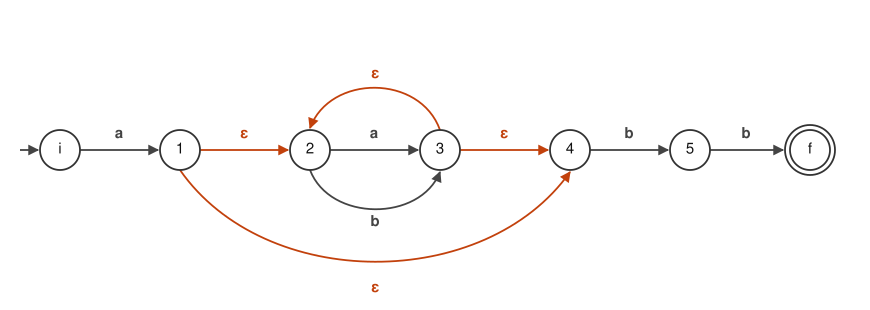

# 01. オートマトンとは


非決定性有限オートマトン (NFA) から決定性有限オートマトン (DFA) への変換は、
正規表現やコンパイラの字句解析に使われる基礎技術であり、実装も容易である。

この章では、そもそも有限オートマトンとは何かを押さえ、
以降の章でずっと使う例を 1 つ用意する。

## 有限オートマトン

有限オートマトンは、**状態**と**遷移**だけでできた機械である。
入力を 1 文字ずつ読み、読んだ文字に応じて今いる状態から次の状態へ移る。
入力を読み終えたときに最終状態にいれば「受理」、そうでなければ「不受理」。

図の読み方は次の通り。

| 表記 | 意味 |
| --- | --- |
| 丸 | 状態 |
| 左から矢印が入っている丸 | 初期状態 |
| 二重丸 | 最終状態（受理状態） |
| 矢印と、その脇の記号 | その記号を読んだときの遷移 |
| オレンジの矢印（`ε`） | 入力を読まずに遷移できる（ε 遷移） |

## 例

以降ずっと使う例として、正規表現

```
a(a|b)*bb
```

を取り上げる。`a` で始まり、`a` と `b` が何個か続き、`bb` で終わる文字列の集まりである。
これに対応する有限オートマトンは、たとえば次のようになる。



オレンジが ε 遷移である。状態 `1` からは ε 遷移が 2 本出ていて、
`2` へ行くか `4` へ行くかが入力では決まらない。
このように**行き先が 1 つに決まらない**有限オートマトンを、
**非決定性有限オートマトン (NFA)** という。

行き先が決まらないと何が困るのか、そしてどう直すのかは、この先の章で扱う。

## この先の流れ

| 章 | 内容 |
| --- | --- |
| [02](02-regex-to-nfa.md) | 正規表現 `a(a\|b)*bb` から NFA を作る |
| [03](03-nfa-to-dfa.md) | 行き先が 1 つに決まる形（DFA）に変換する |
| [04](04-minimize.md) | DFA の状態数を最小化する |
| [付録](appendix-tool.md) | ここまでを繋いで、小さな正規表現ツールを作る |
