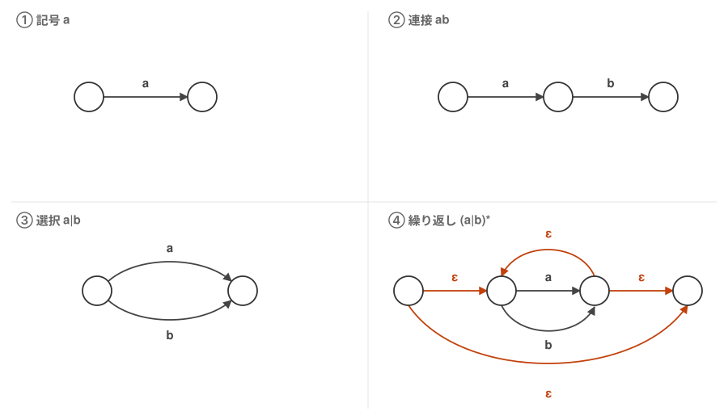
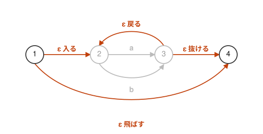

# 02. 正規表現から NFA を作る


[01 章](01-automaton.md) で見た NFA は、天下りに与えられたものだった。
しかしこれは正規表現から機械的に作れる。規則は 4 つしかない。



記号の付いた矢印は入力を 1 文字読んで移ることを、ε の矢印は入力を読まずに移れることを表す。
丸はすべて状態である。

図は `a` と `b` で描いてあるが、この `a` や `b` の位置には、
正規表現の一部がかたまりで入ってよい。
実際④は `(a|b)*` を描いたもので、真ん中の 2 つの丸とそれを結ぶ `a` `b` は③そのものである。
つまり 4 つの規則は、**小さい NFA を部品にして、一回り大きい NFA を作る**手順になっている。

| 規則 | やること |
| --- | --- |
| ① 記号 `a` | 状態を 2 つ作り、間に `a` の遷移を 1 本引く |
| ② 連接 `ab` | `a` の終わりの状態を、そのまま `b` の始まりの状態として使う |
| ③ 選択 `a\|b` | 同じ状態から `a` と `b` の 2 本を引き、行き先を 1 つの状態にまとめる |
| ④ 繰り返し `(a\|b)*` | 繰り返す部分 `a\|b` の前後に状態を置き、図のように ε を 4 本引く |

④ の ε 4 本が、01 章の NFA にあった `1→2` `1→4` `3→2` `3→4` に対応している。
この 4 本がそれぞれ何をしているかは、後で組み立てるときに見る。
ε を使うのはこの規則だけで、②③ は状態をまとめるだけで済ませている。

ここで扱う正規表現は、この 4 つの規則だけで組み立てられるものとする。
ただし、5 つめの規則を [05 章](05-subset.md) で加える。`?`（0 回か 1 回）で、
これも同じやり方で足せる。`a(a|b)*bb` には出てこないので、ここから先では使わない。

> Thompson の構成法では、③ の選択にも新しい状態を 2 つ置いて ε を 4 本引くので、
> 状態数はもっと増える。①②④ は Thompson と同じ形である。
> ③ だけ状態を置かず、両方の枝を同じ状態から出して行き先をまとめたのは、
> 01 章の図と一致させるため。どちらでも受理する文字列は変わらない。

## `a(a|b)*bb` を組み立てる

`a(a|b)*bb` は、`a`、`(a|b)*`、`b`、`b` の 4 つを連接したものである。
このうち `(a|b)*` は `(a|b)` の繰り返しで、`(a|b)` は `a` と `b` の選択になっている。
一番内側から順に規則を当てはめていく。

状態の名前は、できあがる図に合わせて先に付けておく。

### 手順 1: `a|b` に③を当てはめる

状態を 2 つ用意し、片方からもう片方へ `a` と `b` の 2 本を引く。図③そのものである。
この 2 つを `2`、`3` と呼ぶ。


`a` でも `b` でも、1 文字読んで `2` から `3` へ移る。これが「選択」の形である。

### 手順 2: `(a|b)*` に④を当てはめる

手順 1 でできた部品（`a|b` の部分）が、繰り返される**本体**である。
その前と後ろに状態を 1 つずつ足し、前を `1`、後ろを `4` とする。そして ε を 4 本引く。



灰色が手順 1 で作った本体である。オレンジの 4 本がそれぞれ、
本体に**入る**、本体を**飛ばす**（0 回の場合）、
本体の終わりから**戻る**（もう 1 回繰り返す）、本体から**抜ける**、を担当している。

「0 回以上の繰り返し」という意味が、この 4 本にそのまま出ている。
0 回なら「飛ばす」、1 回なら「入る」→本体→「抜ける」、2 回以上なら途中で「戻る」を使う。

これで `(a|b)*` に対応する部品ができた。始まりは `1`、終わりは `4` である。

### 手順 3: 先頭の `a` を①で作り、②で繋ぐ

①で状態を 2 つ作り、`a` の遷移を 1 本引く。
その**終わりの状態を、手順 2 の部品の始まり `1` と同じ状態にする**。これが②の連接である。
残った始まりの状態が全体の初期状態なので `i` と呼ぶ。


### 手順 4: 残りの `b`、`b` を②で繋ぐ

同じように、手順 2 の部品の終わり `4` を始まりとして `b` の遷移を引き、新しい状態 `5` へ。
さらに `5` から `b` で `f` へ。最後の `f` が全体の受理状態である。


### できあがり

引いた遷移は全部で 9 本になる。

```
(i)-- a -->(1)        手順 3
(1)-- ε -->(2)        手順 2 の「入る」
(1)-- ε -->(4)        手順 2 の「飛ばす」
(2)-- a -->(3)        手順 1 の選択
(2)-- b -->(3)        手順 1 の選択
(3)-- ε -->(2)        手順 2 の「戻る」
(3)-- ε -->(4)        手順 2 の「抜ける」
(4)-- b -->(5)        手順 4
(5)-- b -->((f))      手順 4
```

図にすると、01 章に載せた NFA そのものである。


状態の名前 `i, 1, 2, ..., f` は、初期状態から辺をたどっていった順に振ったものである。

つまり 01 章の NFA は、この 4 つの規則を `a(a|b)*bb` に当てはめた結果である。
正規表現さえあれば、NFA は必ず作れる。

## この NFA の問題

こうして作った NFA には、ε 遷移が `1→2` `1→4` `3→2` `3→4` の 4 本ある。
これが動かすときにそのまま困り事になる。
`abb` を入力して、`i` から順にたどってみる。

```
i --a--> 1    ここまでは一本道
1 --ε--> 2 か 4 か？   入力を読まずに 2 手に分かれる
```

`4` を選べば `b`、`b` と読んで `f` に着き、受理できる。
`2` を選べば `b` を読んで `3` に進み、そこからまた `2` か `4` かで分かれる。

入力のどこを読んでいるかに関係なく分岐が起きるので、
**どちらが正解かはその場では分からない**。分かるのは最後まで読み終えてからである。
素直に実装すれば、片方を試して駄目ならもう片方に戻る——後戻り（バックトラック）が要る。
分岐は入れ子にもなるので、入力が長くなると試す組み合わせは急激に増える。

欲しいのは、**今いる状態と次の 1 文字だけで行き先がただ 1 つに決まる**機械である。
それなら分岐しようがなく、入力を頭から 1 回なぞるだけで済む。

では、**どうすれば ε 遷移を消して、そういう形にできるか**。
これが [03 章](03-nfa-to-dfa.md) の話である。
