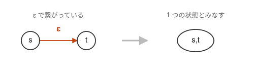
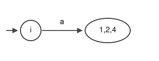
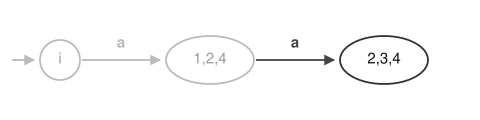
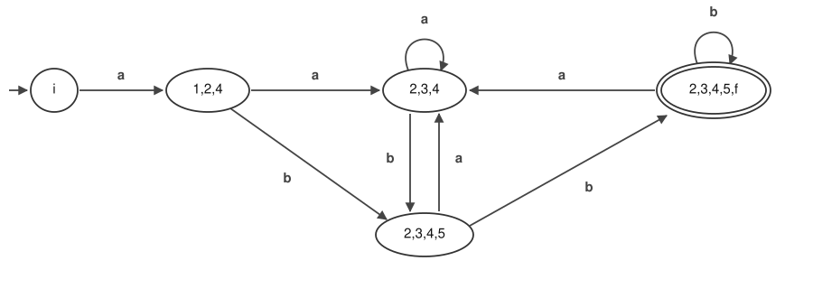

# 03. NFA を DFA に変換する


[02](02-regex-to-nfa.md) の最後に残した問いに答える。
ε 遷移のせいで、状態 `1` にいるとき次が `2` なのか `4` なのか決まらなかった。

## 決定性有限オートマトン (DFA)

欲しいのは、**今いる状態と次の 1 文字が決まれば、行き先の状態がただ 1 つに決まる**
有限オートマトンである。これを**決定性有限オートマトン (DFA)** という。

行き先が決まらなくなる原因は 2 つしかないので、条件は次のように書ける。

1. ε の矢印が 1 本も無い
2. 1 つの状態から、同じ記号の矢印が 2 本以上出ていない

ε の矢印があると、入力を読まないまま次へ動いてしまう。
同じ記号の矢印が 2 本あると、1 文字読んでも行き先が 1 つに絞れない。
どちらも無ければ迷う余地はなく、入力を先頭から 1 文字ずつ 1 回なぞるだけで
受理か不受理かが決まる。後戻りも探索も要らない。

[02](02-regex-to-nfa.md) で作った NFA は、(2) は満たしているが (1) を満たしていない。
消すべきは ε 遷移だけ、ということになる。

## 考え方

発想は単純で、**どちらか分からないなら、両方にいることにしてしまう**。
`2` と `4` の両方にいる、という状態を 1 つ作ればよい。
つまり **DFA の 1 つの状態を、NFA の状態の集合とする**。
こうすれば分岐は起きず、試して戻る必要もなくなる。

## ε 遷移の消去



`(s)` から ε で `(t)` へ行けるなら、`(s)` にいるとき `(t)` にもいると思ってよい。
入力を読まずに移れるのだから、どちらにいるかを区別する意味がない。
そこで両方まとめて、`(s,t)` という 1 つの状態に遷移したと考える。

この「ε だけで行ける状態を全部集めたもの」を **ε 閉包**と呼ぶ。
01 の NFA では `1` から ε で `2` と `4` へ行けるので、次のようになる。



DFA の初期状態は `(i)` である（`i` からは ε 遷移が出ていないため、`i` 1 つだけ）。

## 集合からの遷移を求める

次に、状態 `(1,2,4)` から `a` が入力された時の遷移先を考える。
集合の各要素について調べて、合併すればよい。

| 元状態 | `a` による遷移先 |
| --- | --- |
| 1 | なし |
| 2 | 3 |
| 4 | なし |

`(3)` への遷移しかないのだが、`3` から `2` と `4` へのε遷移があるので、
結局 状態 `(1,2,4)` から `a` による遷移は `(2,3,4)` となる。



次は `(1,2,4)` から `b` が入力された時の遷移を考える。

| 元状態 | `b` による遷移先 |
| --- | --- |
| 1 | なし |
| 2 | 3 |
| 4 | 5 |

そして `3` の場合は `2` と `4` のε遷移があるので、結局 `(2,3,4,5)` となる。

新しい集合が出てこなくなるまで、これを繰り返す。

## 得られた DFA

出てきた集合は全部で 5 つ、遷移は次の通りになる。

| DFA の状態 | `a` による遷移先 | `b` による遷移先 |
| --- | --- | --- |
| `(i)` | `(1,2,4)` | なし |
| `(1,2,4)` | `(2,3,4)` | `(2,3,4,5)` |
| `(2,3,4)` | `(2,3,4)` | `(2,3,4,5)` |
| `(2,3,4,5)` | `(2,3,4)` | `(2,3,4,5,f)` |
| `(2,3,4,5,f)` | `(2,3,4)` | `(2,3,4,5,f)` |

最終状態 `((f))` を含んだ状態が `((2,3,4,5,f))` であり、DFA での終了状態になる。

図にすると次のようになる。



ε 遷移はなくなり、1 つの状態から同じ記号で 2 か所へ行くこともない。
つまり DFA の 2 条件をどちらも満たしている。

なお、初期状態 `i` には `b` による遷移先がない。
`a` 以外で始まる文字列はこの正規表現に一致しようがないので、これは正しい。
遷移表に穴が空いていてよい、ということでもある。

## 何が手に入ったか

[02](02-regex-to-nfa.md) で見た分岐は消えた。
`abb` をたどると、今度は迷うところがない。

```
i --a--> (1,2,4) --b--> (2,3,4,5) --b--> (2,3,4,5,f)
```

最後に着いた `(2,3,4,5,f)` は `f` を含むので受理状態。`abb` は一致する、と決まる。
読むのは 1 回、後戻りもない。

元々の正規表現

```
a(a|b)*bb
```

が DFA の形になれば、**任意の入力テキストが正規表現にマッチしているか否かを簡単に判別できる**
ことに注目してほしい。正規表現エンジンや字句解析器が内部でやっているのはこれである。

## DFA の作成法

> **NFA から DFA の作成手順**
>
> 1. NFA の初期状態とその初期状態から ε 遷移できる状態全てまとめて DFA の初期状態とする。
> 2. DFA の状態（NFA での状態集合）からの遷移は、その NFA 集合の要素からの遷移の合併とし、1 つの DFA 状態とする。
> 3. 上記 2 を新しい集合（DFA での状態）が得られなくなるまで繰り返す。

状態は 5 つある。次の [04](04-minimize.md) で、これを 4 つに減らす。
