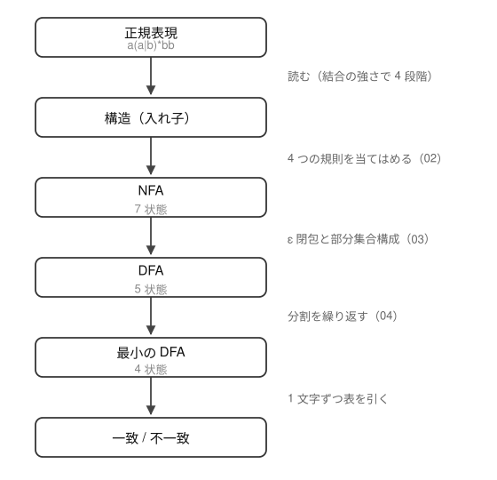

# 05. 扱う正規表現を決める


[01 章](01-automaton.md)〜[04 章](04-minimize.md) では、`a(a|b)*bb` という 1 つの例で
NFA から DFA までの手順を見た。当然、次に気になるのは「他のパターンでも同じようにできるのか」である。

できる。しかも人間が figure を描かなくても、機械が同じ手順を踏むだけでよい。
ここから先は、それを実際に動くものとして作る。

## 扱う範囲

[01 章](01-automaton.md)〜[04 章](04-minimize.md) で相手にしたのは、次の 3 つだけで
組み立てられる正規表現だった。

| 演算 | 意味 | 書き方 | 一致する文字列 |
| --- | --- | --- | --- |
| 連接 | 並べる | `abb` | `abb` |
| 選択 `\|` | どちらか | `a\|b` | `a`、`b` |
| 繰り返し `*` | 0 回以上 | `ab*` | `a`、`ab`、`abb`、… |

これに、優先順位を変える括弧 `( )` が付く（`(a\|b)*` のように）。
括弧は演算ではなく、どこまでが 1 つのまとまりかを示す記法である。

この 3 つは、実は**理論上の正規表現の定義そのもの**である。
普段使う記法の多くは、これに書き換えられる略記に過ぎない。

| よく使う記法 | この 3 つで書くと |
| --- | --- |
| `a+`（1 回以上） | `aa*` |
| `[abc]`（どれか 1 文字） | `(a\|b\|c)` |
| `a{2,3}`（2〜3 回） | `aa\|aaa` |

## もう 1 つ、`?` を足す

書き換えられないものが 1 つある。`a?`（0 回か 1 回）である。
これは「`a` または**何も無い**」という意味だが、
「何も無い」を表す書き方が上の 3 つには無い。
[02 章](02-regex-to-nfa.md) で「⑤ として足せる」と触れたのが、これにあたる。

よく使う記法なので、実装では足すことにする。**足すのは規則 1 つだけ**である。

| 演算 | 意味 | 書き方 | 一致する文字列 |
| --- | --- | --- | --- |
| 省略 `?` | 0 回か 1 回 | `ab?c` | `ac`、`abc` |

[02 章](02-regex-to-nfa.md) で見た 4 つの規則に、5 つめとして
「本体を作り、その入口から出口へ ε を 1 本引く」を加えるだけで済む。
繰り返し `*` が ε を 4 本引くのに対し、`?` は「飛ばす」1 本だけ——
戻る道が無いので、本体を通るのは多くても 1 回になる。詳しくは [06 章](06-parse-nfa.md) で見る。

そして**それ以外は何も変わらない**。
ε 遷移が 1 本増えるだけなので、[03 章](03-nfa-to-dfa.md) の部分集合構成がそのまま吸収する。
DFA 化も最小化も一致判定も、書き換える必要が無い。

規則を 1 つ足すだけで扱える記法が増える——このことが、
01〜04 章で見た手順が**その場しのぎではない**ことを示している。

## 扱わないもの

`.`（任意の 1 文字）も文字クラス `[ ]` も回数指定 `{n,m}` もアンカー `^` `$` も無い。
後方参照（`\1`）に至っては、DFA では原理的に表せない。

`(` `)` `|` `*` `?` 以外の文字は、すべてそのまま 1 文字の記号として扱う。
空のパターン（`''`）と空の括弧（`()`）は受け付けない。

そして **この範囲のパターンなら、どれが来ても同じ手順で処理できる**。
`a(a|b)*bb` のために特別なことは何もしない。
パターンを読み、NFA を作り、DFA にして、状態数を減らし、表を引く。それだけである。

## 全体の流れ



01〜04 章で見た手順が、そのまま 1 つずつ部品になる。

| 段階 | 理屈を見た章 | 実装を見る章 |
| --- | --- | --- |
| パターンを読む | — | [06 章](06-parse-nfa.md) |
| NFA を作る | [02 章](02-regex-to-nfa.md) | [06 章](06-parse-nfa.md) |
| DFA にする | [03 章](03-nfa-to-dfa.md) | [07 章](07-dfa-match.md) |
| 状態数を最小化する | [04 章](04-minimize.md) | [07 章](07-dfa-match.md) |
| 一致判定する | [04 章](04-minimize.md) | [07 章](07-dfa-match.md) |

「パターンを読む」だけは 01〜04 に対応する章が無い。
そこでは正規表現の構造を人間が目で見て取っていたので、説明する必要が無かった。
機械にやらせるとなると、そこも手順にしなければならない。

言語は Python。3.6 以上なら、標準ライブラリだけで動く。

## 先に動かしてみる

出来上がるものはこれである。パターンとテキストを渡すと、一致するかどうかを答える。

```
$ python3 -m automaton 'a(a|b)*bb' abb ab aabb ababb bb
match     'abb'
no match  'ab'
match     'aabb'
match     'ababb'
no match  'bb'
```

テキストを渡さなければ標準入力から読むので、grep のようにも使える。

```
$ printf 'abb\nab\naabb\nxyz\nababb\n' | python3 -m automaton 'a(a|b)*bb'
abb
aabb
ababb
```

もちろん `a(a|b)*bb` 以外でも動く。`(ab)*` は 0 回でもよいので、`c` だけでも一致する。

```
$ python3 -m automaton '(ab)*c' c abc ababc ab
match     'c'
match     'abc'
match     'ababc'
no match  'ab'
```

判定は文字列**全体**の一致で、部分一致の検索はしない。

## 本当に全部扱えるのか

「この範囲なら何でも」と言い切るには根拠がいる。
`tests/` では、いくつかのパターンについて短い文字列を総当たりし、
Python の `re` と同じ判定になることを確かめている。
`a(a|b)*bb` については長さ 7 以下の全文字列、
`a?`、`ab?`、`(a|b)?c`、`(a?b)*` なども含めて長さ 5 以下の全文字列である。

さらに、4 つの演算をランダムに組み合わせて作った 400 個のパターン
（うち 119 個が `?` を含む）について、
長さ 5 以下の全文字列（`a`、`b`、`c` の並び）で `re` と突き合わせ、
1 件も食い違いが出ないことを確認した。

では [06 章](06-parse-nfa.md) から、順に作っていく。
