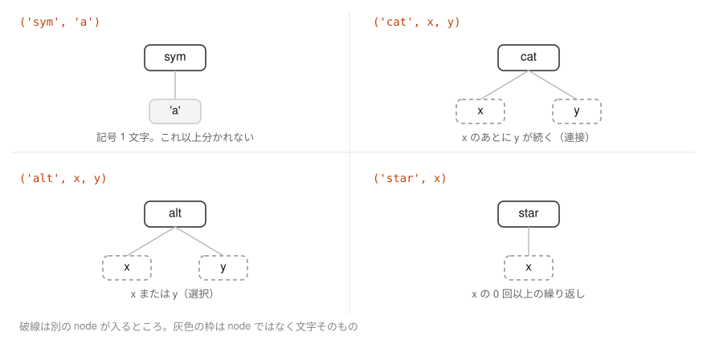
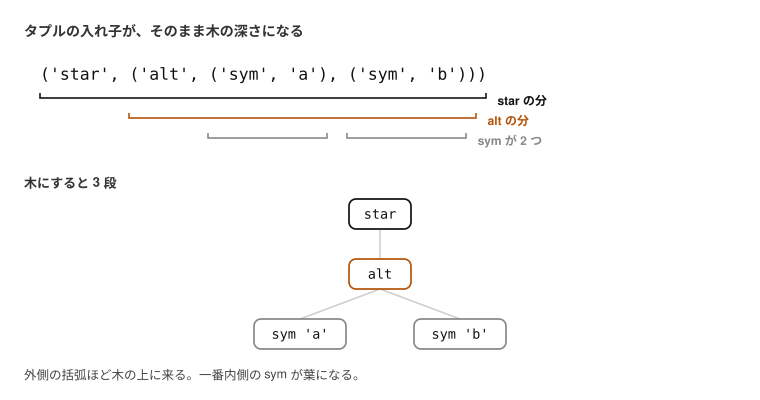
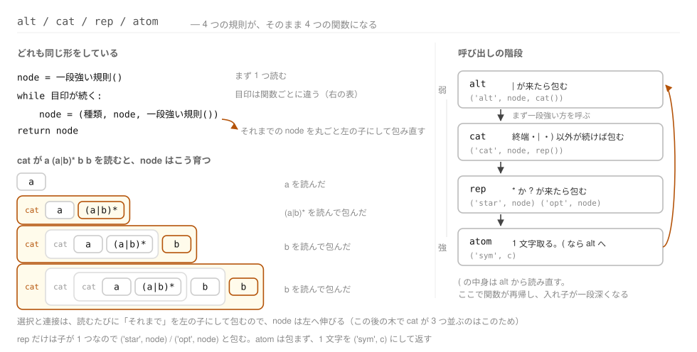
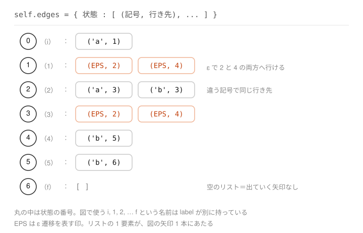
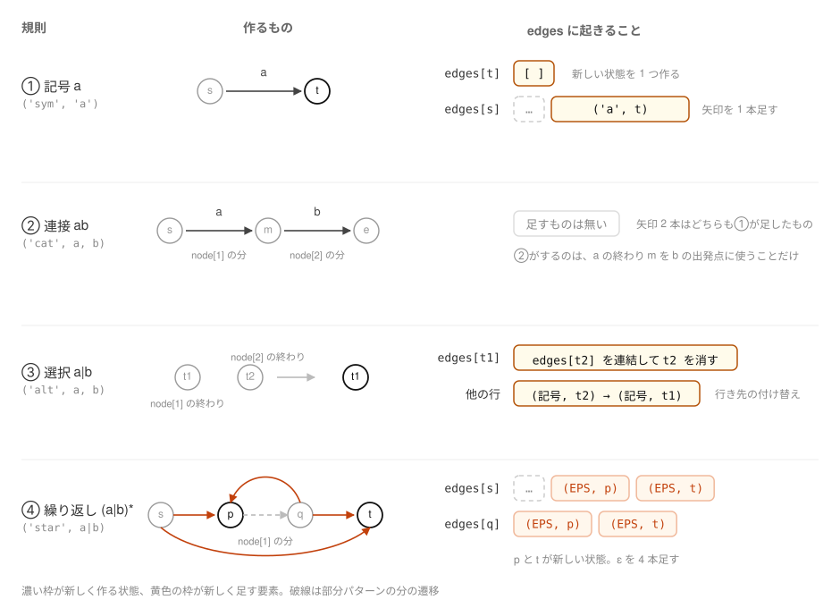
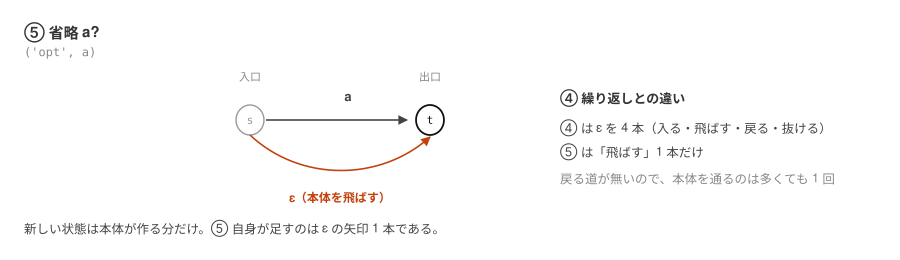
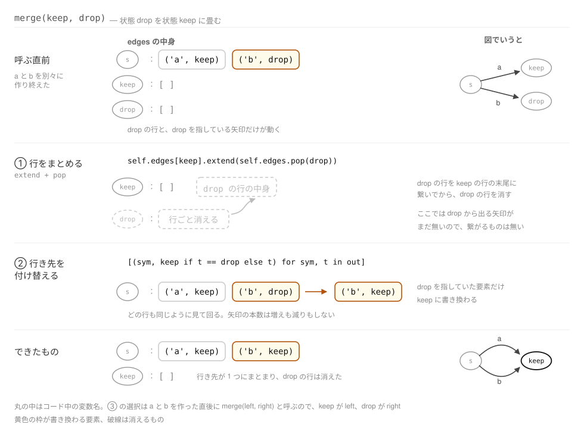

# 06. パターンを読んで NFA にする


[05 章](05-subset.md) で決めた範囲の正規表現を受け取り、NFA にするところまでを作る。
やることは 2 つ、パターンを読んで構造を取り出すことと、
[02 章](02-regex-to-nfa.md) の 4 つの規則（と、[05 章](05-subset.md) で足した 5 つめ）を
当てはめることである。

## 1. パターンを読む

本編では `a(a|b)*bb` の構造を人間が見て取っていたが、
ツールにするならここも機械にやらせる必要がある。

正規表現の演算子には**結合の強さ**があり、強い順に
`*`（繰り返し）、連接、`|`（選択）である。
たとえば `a|bb*` は `a` と `bb*` の選択であって、`(a|b)b*` ではない。

そこで、弱い演算子から順に 4 段階の規則として書き下す。

```
alt  -> cat { '|' cat }      選択      : 連接を | で並べたもの
cat  -> rep { rep }          連接      : 繰り返しを並べたもの
rep  -> atom { '*' | '?' }   繰り返し  : 要素に * や ? が付いたもの
atom -> '(' alt ')' | 文字   要素      : 括弧でくくった選択、または 1 文字
```

`->` は「左辺はこういう形をしている」、`{ }` は 0 回以上の繰り返しを表す。
引用符付きの `'|'` `'*'` `'?'` `'('` は正規表現に現れる文字そのもので、
引用符の無い `|`（`rep` と `atom` の行）は規則の側の「または」である。

弱い規則が強い規則を呼ぶ形になっているので、上から順に読んでいけば
結合の強さどおりに入れ子が取れる。
`atom` が `alt` に戻っているのは括弧のためで、ここで入れ子が一段深くなる。

パターン文字列は、先頭から 1 文字ずつ見ていく。
その読み取り位置を持つのが `_Parser` で、操作は 2 つだけである。

```python
class _Parser:
    def __init__(self, pattern):
        self.s = pattern
        self.i = 0

    def peek(self):
        return self.s[self.i] if self.i < len(self.s) else None

    def take(self):
        c = self.peek()
        if c is None:
            raise ValueError("unexpected end of pattern")
        self.i += 1
        return c
```

`peek()` は今の位置の文字を**見るだけ**で、位置は動かさない。
`take()` は今の位置の文字を返して、位置を 1 つ進める。つまり 1 文字読み進める。
末尾まで来ると `peek()` は `None` を返すので、規則の側はそれで終わりを知る。

ここで読んでいるのは**パターンの文字**であって、照合するテキストではない。
テキストの方を 1 文字ずつ読むのは、後の一致判定（[07 章](07-dfa-match.md) の 5 節）である。

### 規則が作るもの — node

規則が作るのは **node** と呼ぶ小さなタプルで、
先頭が種類の名前、残りが子である。種類は 5 つしかない。



子のところにはまた node が入る。だから node は木になる。



括弧の深さが、そのまま木の段数になる。
一番外の `star` が根、その子が `alt`、さらにその子が `sym` 2 つで葉である。

### 規則を関数にする

文法の 4 つの規則は、そのまま 4 つの関数になる。どの関数も、返すのは node である。

```python
    def alt(self):
        node = self.cat()
        while self.peek() == "|":
            self.take()
            node = ("alt", node, self.cat())
        return node

    def cat(self):
        node = self.rep()
        while self.peek() not in (None, "|", ")"):
            node = ("cat", node, self.rep())
        return node

    def rep(self):
        node = self.atom()
        while self.peek() in ("*", "?"):
            node = ("star" if self.take() == "*" else "opt", node)
        return node

    def atom(self):
        c = self.take()
        if c == "(":
            node = self.alt()
            if self.peek() != ")":
                raise ValueError("')' expected")
            self.take()
            return node
        if c in "|*?)":
            raise ValueError(f"unexpected {c!r}")
        return ("sym", c)
```

`alt` `cat` `rep` はどれも同じ形をしている。まず一段強い規則を 1 回呼び、
目印が続く限り、**それまでの node を左の子にして包み直す**。



`atom` が `alt` を呼び戻すので、関数も再帰する。
この読み方を**再帰的下向き構文解析**という。

### 読んだ結果

実際に `a(a|b)*bb` を読ませると、こうなる。

```python
>>> from automaton.regex import parse
>>> parse("a(a|b)*bb")
('cat', ('cat', ('cat', ('sym', 'a'), ('star', ('alt', ('sym', 'a'), ('sym', 'b')))), ('sym', 'b')), ('sym', 'b'))
```

括弧が深くて読みにくいが、木に描けば素直な形をしている。


`cat` が 3 つ並んで左に伸びているのは、`a`・`(a|b)*`・`b`・`b` の 4 つの連接を
左から 2 つずつまとめているためである。
`(a|b)*` の部分が `star` → `alt` → `sym` 2 つ、という枝になっている。

この木を次の節でたどって、NFA を組み立てる。

## 2. NFA を作る

[02 章](02-regex-to-nfa.md) で見た 4 つの規則（と、このあと足す 5 つめ）を、
読み取った node の木にあてはめる。

組み立て先の `NFA` は、状態と遷移を溜めておくだけの入れ物である。
`state()` で状態を 1 つ増やし、`add()` で矢印を 1 本足す。

```python
class NFA:
    def __init__(self):
        self.n = 0        # number of states handed out so far
        self.edges = {}   # state -> [(symbol or EPS, state)], in construction order
        self.start = None
        self.accept = None
        self.label = {}   # state -> display name

    def state(self):
        """Add a fresh state and return it."""
        s = self.n
        self.n += 1
        self.edges[s] = []
        return s

    def add(self, s, sym, t):
        self.edges[s].append((sym, t))
```

NFA の中身は実質 `edges` だけで、これは
**「状態」から「そこを出ている矢印のリスト」への辞書**である。
`a(a|b)*bb` を作り終えた時点の中身がこれにあたる。



リストの 1 要素 `(記号, 行き先)` が、図の矢印 1 本にそのまま対応する。
状態 `1` の行に `(EPS, 2)` と `(EPS, 4)` が並んでいるのは、
`1` から ε で 2 か所へ行けるということであり、
02 で「行き先が決まらない」と言った状況がここに現れている。
受理状態 `f` の行が空リストなのは、出ていく矢印が無いからである。

辞書のキーは `0` `1` `2` … という番号で、図に書いた `i` `1` `2` … という名前は
`label` が別に持つ。**キーと状態は 1 対 1 に対応する**。
`0` が `i`、`6` が `f` というように、1 つのキーがちょうど 1 つの状態を指す。

この持ち方だと、ある状態から出ている矢印を全部見るのが、辞書を 1 回引くだけで済む。
`edges[0]` と書けば `[('a', 1)]`、つまり図の `i` の行がそのまま返る。
ε 閉包も部分集合構成も、やることは結局この走査なので、後の節が短く書ける。

残る `start` と `accept` は、入口と出口を 1 つずつ覚えておくためのものである。
`build` が `start` に最初に作った状態を、`accept` に `_build` の戻り値
（＝パターン全体を作り終えて到達した状態）を入れる。
図の `i` と `f` は、この 2 つに付くラベルである。

この入れ物に書き足していくのが `_build(nfa, node, s)` である。
3 つの引数は、それぞれこういう役割を持つ。

| 引数 | 説明 |
| --- | --- |
| `nfa` | 組み立て中の NFA。**ここに状態と遷移が書き足されていく** |
| `node` | パターンのどの部分を作るか。前の節で読み取った木の一部 |
| `s` | どこから作るか。すでにある状態 1 つ |

戻り値は、**作り終えて到達した状態**である。

たとえば `node` が `('sym', 'b')`、`s` が状態 `4` のとき、`_build` は
新しい状態 `5` を作り、`4 -- b --> 5` の矢印を 1 本引いて、`5` を返す。
`s` が入口、戻り値が出口で、その間に出来たものが「`node` の分」である。
次の部品は、返ってきた `5` を入口にして作る。

`node` は照合するテキストではなく、パターン側の構造であることに注意。
向きとしては、**node の木を読みながら `nfa` に書き足していく**。
タプルを組み立てるのではない。タプルは既にあって、それが設計図になる。

戻り値が「到達した状態」なので、②の連接は
「`a` の終わりから `b` を作り足す」だけで済む。`cat` の行が
`_build(nfa, node[2], _build(nfa, node[1], s))` と入れ子になっているのがそれで、
連接のために新しく足す状態も矢印も無い。

```python
def _build(nfa, node, s):
    """Extend `nfa` from state `s` so that it accepts `node`; return the state reached."""
    kind = node[0]
    if kind == "sym":
        t = nfa.state()
        nfa.add(s, node[1], t)
        return t
    if kind == "cat":
        return _build(nfa, node[2], _build(nfa, node[1], s))
    if kind == "alt":
        left = _build(nfa, node[1], s)
        right = _build(nfa, node[2], s)
        nfa.merge(left, right)  # both branches end in the same state
        return left
    if kind == "opt":
        end = _build(nfa, node[1], s)
        nfa.add(s, EPS, end)     # skip the body entirely
        return end
    if kind == "star":
        body = nfa.state()
        nfa.add(s, EPS, body)
        end = _build(nfa, node[1], body)
        out = nfa.state()
        nfa.add(s, EPS, out)     # skip the body entirely
        nfa.add(end, EPS, body)  # go round again
        nfa.add(end, EPS, out)   # leave the loop
        return out
    raise ValueError(f"unknown node {kind!r}")
```

### node[1] と node[2]

コードに出てくる `node[0]` `node[1]` `node[2]` は、
前節のタプルの何番目かを指しているだけである。

| 要素 | `('cat', a, b)` なら | `('star', a)` なら |
| --- | --- | --- |
| `node[0]` | `'cat'` — 種類の名前 | `'star'` |
| `node[1]` | `a` — 先に来る方 | `a` — 繰り返す本体 |
| `node[2]` | `b` — 後に来る方 | （無い） |

連接の行が入れ子になっているのは、このためである。
同じことを 2 行に分けて書くと、こうなる。

```
m = _build(nfa, node[1], s)        先に来る方を s から作る。m は到達した状態
return _build(nfa, node[2], m)     後に来る方を m から作り、その到達した状態を返す
```

内側の呼び出しが返す状態が、外側の呼び出しの「どこから作るか」になる。
`ab` なら、`a` を作って着いた状態がそのまま `b` の出発点になる、ということである。

そして外側の呼び出しが返す状態、つまり `b` を作り終えて着いた状態が、
`ab` 全体の終わりとして呼び出し元に返る。
どの規則も「作り終えて到達した状態を返す」ので、部品をいくつ繋いでも同じように書ける。

5 つの規則が `edges` に対して何をするのかを並べると、次のようになる。



見どころは 3 つある。

**②の連接は `edges` を触らない。** 新しい状態も矢印も足さない。
`a` の終わりの状態からそのまま `b` を作り始めるだけで、
それは「`_build` の第 3 引数に `a` の戻り値を渡す」ことで表現できてしまう。

**③の選択も矢印は足さない。** `a` と `b` をそれぞれ作ると、
終わりの状態が `left`、`right` と 2 つできてしまうので、これを 1 つにまとめる。
`edges` の上でやることは、**`right` を指していた矢印を `left` に向け直し、
`right` の行を消す**、それだけである。
図の `b` の矢印が `right` から `left` へ付け替わっているのがそれにあたる。
矢印の本数は変わらない。

**ε を足すのは④である。** `edges[s]` に 2 本（入る・飛ばす）、
本体の終わりの行に 2 本（戻る・抜ける）で、合わせて 4 本。
02 で見た ε 4 本が、ここでは `(EPS, 行き先)` という 4 つの要素として現れる。

つまり `edges` が実際に増えるのは、**記号 1 文字につき矢印 1 本**（①）と、
**繰り返し 1 つにつき ε 4 本**（④）である。
`a(a|b)*bb` なら記号が 5 つ、繰り返しが 1 つなので、5 + 4 = 9 本。
[02 章](02-regex-to-nfa.md) で数えた 9 本と合う。

このあと足す⑤も ε を 1 本だけ増やす。②と③は最後まで何も足さない。

### ⑤ 省略 `x?`

[05 章](05-subset.md) で足すことにした `?` が、`opt` の 3 行である。



本体を `s` から作って `end` に着いたら、`s` から `end` へ ε を 1 本引く。
それが「本体を飛ばす」道になる。新しい状態は 1 つも作らない。

```python
    if kind == "opt":
        end = _build(nfa, node[1], s)
        nfa.add(s, EPS, end)     # skip the body entirely
        return end
```

`ab?` を作ると、`1` から `f` へ `b` の矢印と ε の矢印が並ぶ。

```python
>>> from automaton.nfa import build, dump
>>> dump(build("ab?"))
 i -- a --> 1
 1 -- b --> f
 1 -- ε --> f
```

③で使う `merge` は、状態 `drop` を状態 `keep` に統合する。
`_build` からは `merge(left, right)` と呼ばれるので、`keep` が `left`、`drop` が `right` である。
`drop` の行を `keep` に連結してから消し、`drop` を指していた遷移を `keep` に付け替える。

```python
    def merge(self, keep, drop):
        """Fold state `drop` into state `keep`."""
        if keep == drop:
            return
        self.edges[keep].extend(self.edges.pop(drop))
        for s, out in self.edges.items():
            self.edges[s] = [(sym, keep if t == drop else t) for sym, t in out]
```

この連結と付け替えが `edges` に何をするのかを、呼ぶ直前から順に追うとこうなる。



なお `drop` は枝を作り終えた直後の状態なので、そこから出ていく矢印はまだ 1 本も無い。
つまり最初の連結は実際には何も動かさず、効いているのは後半の付け替えの方だけである
（連結はどんな使われ方をしても壊れないようにするための一般化）。

最後に状態の番号を振り直す。統合で番号に欠番が出るうえ、
本編の図の `1, 2, 3, ...` は機械を通っていく順に振られているので、
初期状態から深さ優先でたどった順に付け直す（`automaton/nfa.py` の `_renumber`）。

```python
>>> from automaton.nfa import build, dump
>>> dump(build("a(a|b)*bb"))
 i -- a --> 1
 1 -- ε --> 2
 1 -- ε --> 4
 2 -- a --> 3
 2 -- b --> 3
 3 -- ε --> 2
 3 -- ε --> 4
 4 -- b --> 5
 5 -- b --> f
```

[02 章](02-regex-to-nfa.md) で手で組み立てた 9 本と、辺も状態の名前も一致している。

---

ここまでで、どんなパターンからでも NFA が作れるようになった。
[07 章](07-dfa-match.md) では、これを DFA に変えて一致判定まで持っていく。
