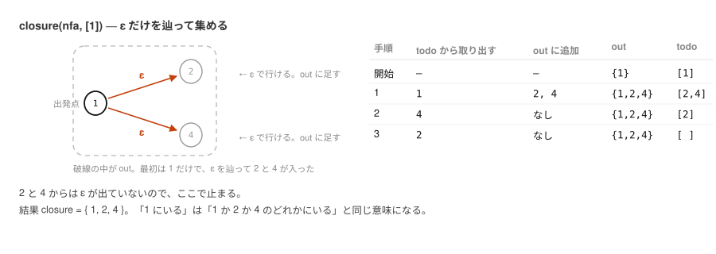
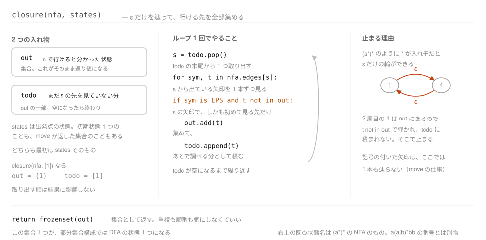
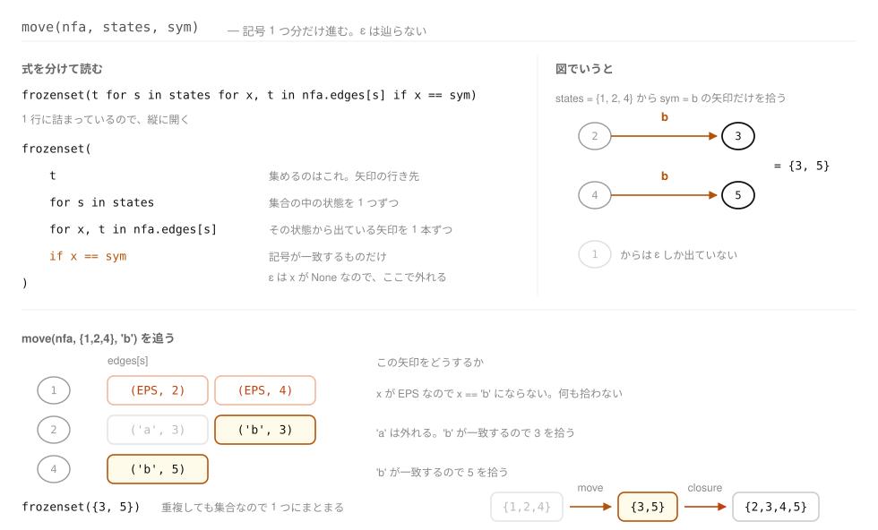
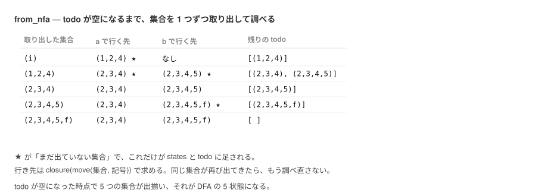
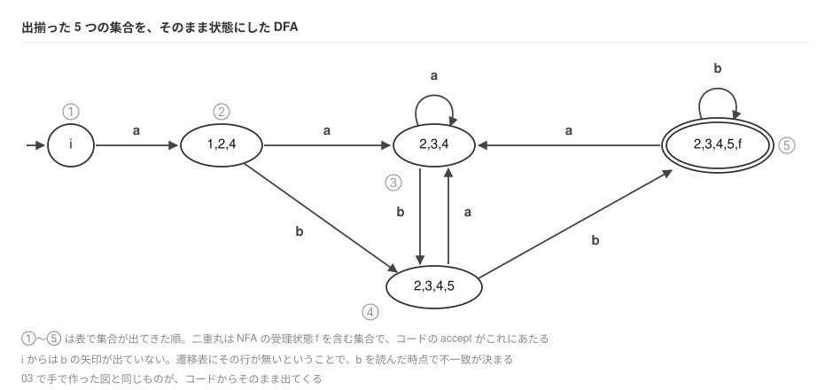
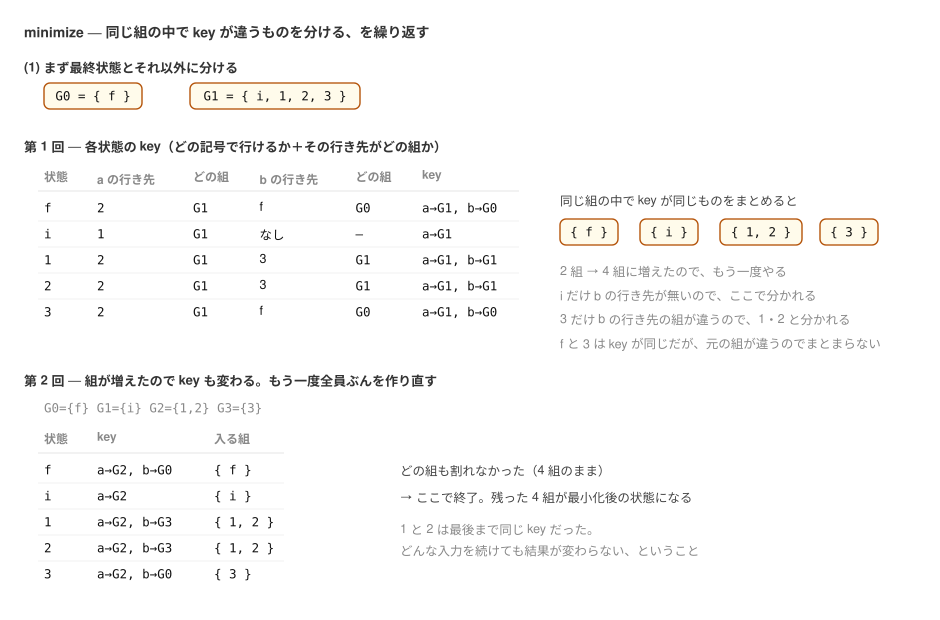
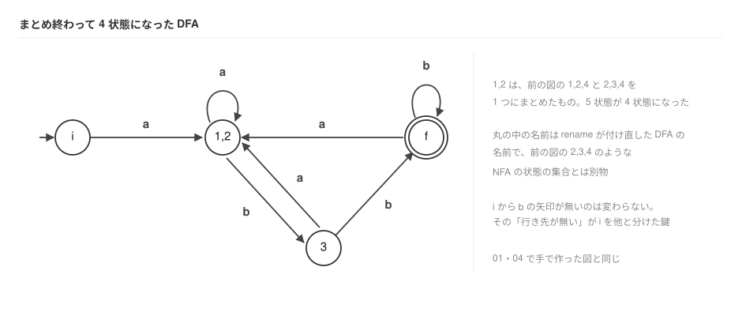
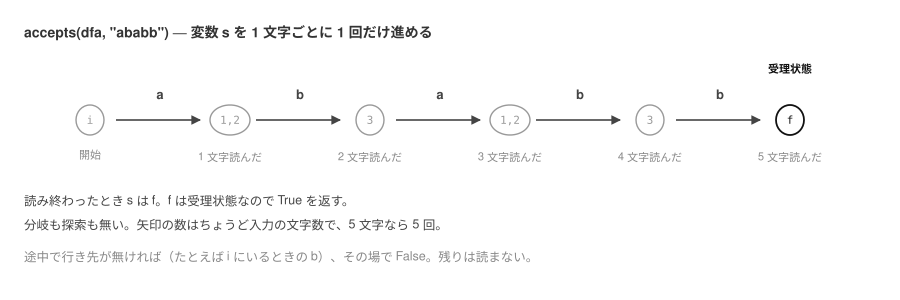

# 07. DFA にして判定する


[06 章](06-parse-nfa.md) でパターンから NFA を作った。
ここからは [03 章](03-nfa-to-dfa.md)、[04 章](04-minimize.md) の手順をコードにして、
最後にコマンドとして繋ぐ。

## 出発点にあるもの

06 章を通すと、手元にはこういうデータが残る。

```python
>>> from automaton.nfa import build
>>> nfa = build("a(a|b)*bb")
>>> nfa.start, nfa.accept
(0, 6)
>>> for s in sorted(nfa.edges):
...     print(s, nfa.label[s], nfa.edges[s])
0 i [('a', 1)]
1 1 [(None, 2), (None, 4)]
2 2 [('a', 3), ('b', 3)]
3 3 [(None, 2), (None, 4)]
4 4 [('b', 5)]
5 5 [('b', 6)]
6 f []
```

持っているのは 3 つだけである。

| 持ち物 | 中身 |
| --- | --- |
| `edges` | 状態ごとの「出ている矢印」の一覧。`None` が ε |
| `start` `accept` | 入口と出口の状態。ここでは `0` と `6` |
| `label` | 表示用の名前。`0` が `i`、`6` が `f` |

これが 06 章の出力であり、この章の入力である。
ここから、ε の無い形——DFA を作っていく。

## 3. DFA にする

[03 章](03-nfa-to-dfa.md) の ε 閉包と、記号による遷移先の合併。
どちらも定義をそのまま書いただけである。

`closure` という名前で定義した関数は、第 2 引数 `states` に渡された状態から始めて、
ε で行ける状態を全部集め、`out` に入れていく。
`states` は出発点で、初期状態 1 つのこともあれば、`move` が返した集合のこともある。
`out` は `set(states)` で始めるので、渡した `states` はそのまま結果に残る。

その `out` のうち、**まだ ε の先を見ていないもの**が `todo` である。
`todo` は `out` の一部であって、NFA の未調査の状態ではない。
`todo` から 1 つ取り出し、その ε の先が初めて出てきたものなら、
`out` と `todo` の両方に足す。`out` は答えを溜めるため、`todo` はその先も調べるためである。
`todo` が空になったら、もう伸ばせる先が無い。
`a(a|b)*bb` の NFA で `closure(nfa, [1])` を呼ぶと、3 手で止まる。



同じ状態を二度 `todo` に積まないので、**ε 遷移だけを辿って元の状態に戻れる**場合でも止まる。
`a(a|b)*bb` の ε 遷移（`1→2` `1→4` `3→2` `3→4`）を辿っても元には戻らないが、
`(a*)*` のように `*` が入れ子になると、`1 → 4 → 1` のように ε だけで一周できてしまう。
そうなっても、2 周目の行き先は `out` にもう入っているので `todo` に積まれず、そこで止まる。

```python
def closure(nfa, states):
    """The epsilon-closure: every state reachable without reading any input."""
    out, todo = set(states), list(states)
    while todo:
        s = todo.pop()
        for sym, t in nfa.edges[s]:
            if sym is EPS and t not in out:
                out.add(t)
                todo.append(t)
    return frozenset(out)


def move(nfa, states, sym):
    """Where `sym` takes us from any of `states`, ignoring epsilon."""
    return frozenset(t for s in states for x, t in nfa.edges[s] if x == sym)
```

どちらも `frozenset` を返している。これは Python の**中身を変えられない集合**である。
`{1, 2, 4}` のような普通の集合（`set`）は後から要素を足せるが、`frozenset` は作ったら固定で、
そのぶん**辞書のキーにしたり、別の集合の要素にしたりできる**。

この先、DFA の 1 つの状態は「NFA の状態の集合」そのものになる。
集合を状態として持ち回り、`trans[(集合, 記号)]` のように辞書を引くので、
変わらない集合であることが要る。

コードの側から見ると、`closure` がやっているのは 2 つの入れ物の出し入れである。



`move` は逆に、ε を 1 本も辿らず、記号 1 つ分だけ進む。
集合の中のどの状態から出ている矢印でも、記号が一致すればその行き先を集める。



記号で 1 歩進んでから ε で広げる、つまり `closure(move(...))` が、
次の `from_nfa` の 1 マスになる。

作成手順の (1)〜(3) がそのまま `from_nfa` になる。
`closure` と同じ形で、初めて出てきた集合を `states` と `todo` の両方に足す。
`states` が「出てきた集合の一覧」、`todo` が「まだ行き先を調べていない集合」で、
`todo` が空になったら終わりである。

```python
def from_nfa(nfa):
    """Subset construction: one DFA state is a set of NFA states."""
    start = closure(nfa, [nfa.start])
    states, todo, trans = [start], [start], {}
    while todo:
        cur = todo.pop(0)
        for sym in symbols(nfa):
            nxt = closure(nfa, move(nfa, cur, sym))
            if not nxt:
                continue  # no transition on this symbol
            if nxt not in states:
                states.append(nxt)
                todo.append(nxt)
            trans[(cur, sym)] = nxt
    accept = {s for s in states if nfa.accept in s}
    name = {s: ",".join(nfa.label[k] for k in sorted(s)) for s in states}
    return DFA(states, start, accept, trans, name)
```

DFA の 1 つの状態が、`frozenset`（NFA の状態の集合）そのものである。
集合をそのまま辞書のキーにできるので、
「もう出てきた集合かどうか」の判定が `nxt not in states` の 1 行で済む。

出発集合は `nfa.start` の ε 閉包、受理状態は `nfa.accept` を含む集合。
[03 章](03-nfa-to-dfa.md) の 2 つの決まりが、最初の行と `accept = ...` の行に
そのまま出ている。

`todo` が空になるまで、集合を 1 つ取り出しては記号ごとに行き先を求める。
取り出したものが `cur`、求めた行き先が `nxt` である。



5 回回ったところで `todo` が空になり、集合は 5 つ出揃った。これが DFA の状態である。
丸と矢印で描き直すと、[03 章](03-nfa-to-dfa.md) で手で作ったものと同じ機械になる。



遷移表の形でも確かめておく。

```python
>>> from automaton.nfa import build
>>> from automaton.dfa import from_nfa, table
>>> table(from_nfa(build("a(a|b)*bb")))
状態        a による遷移先  b による遷移先
i           1,2,4           なし
1,2,4       2,3,4           2,3,4,5
2,3,4       2,3,4           2,3,4,5
2,3,4,5     2,3,4           2,3,4,5,f
2,3,4,5,f*  2,3,4           2,3,4,5,f
```

## 4. 状態数を最小化する

### まず名前を短くする

[04 章](04-minimize.md) の冒頭で `(1,2,4)` を `1` と書き直したのと同じことを、
`rename` がする。集合のままでは長いうえ、最小化ではさらに集合をまとめるので、
「集合の集合」になって読めなくなるからである。

読みやすさのためだけの処理に見えるが、そうではない。
このあとの `minimize` は、まとめた状態の名前を繋げて新しい名前にするので、
状態の名前が文字列になっていること自体を前提にしている。
`from_nfa` の結果を `rename` を通さずに `minimize` へ渡すことはできない。

出てきた順に、初期状態を `i`、受理状態を `f`、残りを `1` `2` `3` … と付け替える。

```python
def rename(dfa):
    """Replace each set of NFA states by a short name: i, 1, 2, ..., f."""
    name, k, a = {}, 0, 0
    for s in dfa.states:
        if s == dfa.start:
            name[s] = "i"
        elif s in dfa.accept:
            a += 1
            name[s] = "f" if a == 1 else f"f{a}"
        else:
            k += 1
            name[s] = str(k)
```

残りの行は、この対応表（変数 `name`）で `states`・`start`・`accept`・`trans` を
作り直しているだけである。
機械の形は変わらない。変わるのは名前だけである。

```python
>>> from automaton.nfa import build
>>> from automaton.dfa import from_nfa, rename, table
>>> table(rename(from_nfa(build("a(a|b)*bb"))))
状態  a による遷移先  b による遷移先
i     1               なし
1     2               3
2     2               3
3     2               f
f*    2               f
```

[04 章](04-minimize.md) に載せた表と同じものである。
**ここから先の `i` `1` `2` `3` `f` は、この付け替え後の名前**であって、
NFA の状態とは無関係なので注意。

### 分割を繰り返す


[04 章](04-minimize.md) の分割の繰り返し。
各状態について「どの記号で遷移できるか」と「その遷移先がどの集合に属するか」を
組にしたものを作る。コードではこれを `key` と呼び、`buckets` という辞書のキーに使う。
同じ組の中で `key` が同じ状態どうしが `buckets` の同じリストに入り、
`key` が違えば別のリストに分かれる。このリストがそのまま次の組になる。
`buckets` は `for g in groups:` の内側で作り直すので、組をまたいで `key` が一致しても、
一度分かれた組が再び合流することはない。
手順の (2) が前半、(3) が後半にあたるので、実装ではこの 2 つを 1 つの `key` にまとめている。

```python
    # (1) split into the accepting states and the rest
    groups = [g for g in ([s for s in dfa.states if s in dfa.accept],
                          [s for s in dfa.states if s not in dfa.accept]) if g]
    while True:
        where = {s: i for i, g in enumerate(groups) for s in g}
        split = []
        for g in groups:
            buckets = {}
            for s in g:
                # (2) which symbols have a transition at all, and
                # (3) which group each of those transitions leads to
                key = tuple((sym, where[dfa.trans[(s, sym)]])
                            for sym in alphabet if (s, sym) in dfa.trans)
                buckets.setdefault(key, []).append(s)
            split.extend(buckets.values())
        if len(split) == len(groups):  # (4) nothing split any further
            break
        groups = split
```

最初の `groups = ...` の 1 行が詰まっているので、分解しておく。
同じことを 3 行に分けて書くと、こうなる。

```
accept = [s for s in dfa.states if s in dfa.accept]       # ['f']
other  = [s for s in dfa.states if s not in dfa.accept]   # ['i', '1', '2', '3']
groups = [g for g in (accept, other) if g]
```

1 行目が受理状態を集めたリスト、2 行目がそれ以外を集めたリストで、
これが手順 (1) の「最終状態とそれ以外に分ける」そのものである。
3 行目はその 2 つを並べるだけ——ただし `if g` が付いていて、
**空のリストなら捨てる**。

捨てる必要があるのは、片方が空になることがあるからである。
`a*` の DFA は状態が 2 つとも受理状態なので、`other` が空のリストになる。
そのまま残すと「番号はあるが中身が無い組」ができてしまう。

結果として `groups` は**組のリスト**になり、1 つの組は状態名のリストである。
`a(a|b)*bb` なら、手順 (1) の直後はこうなる。

```
groups = [['f'], ['i', '1', '2', '3']]
```

0 番目が受理状態の組、1 番目がそれ以外の組である。
これが分かれていき、最後に残った 1 つの組が、そのまま 1 つの状態になる。

`where` は、状態名から**その状態が今いる組の番号**——
つまり `groups` の何番目にいるか——を引く辞書である。
手順 (1) の直後なら、中身はこうなる。

```
where = {'f': 0, 'i': 1, '1': 1, '2': 1, '3': 1}
```

`f` だけが 0 番の組、残りは全部 1 番の組、という意味である。

`key` は、この番号を使って作る。状態 `3` は `a` で `2` へ、`b` で `f` へ行くので、
`where['2']` と `where['f']` を引いて、`key` は `(('a', 1), ('b', 0))` になる。
状態 `1` は `a` で `2`、`b` で `3` へ行き、どちらも 1 番の組だから `(('a', 1), ('b', 1))`。
**`key` が違うので、`1` と `3` は別の組に分かれる**。

状態 `i` は `b` の行き先が無いため、`key` の要素が 1 つしかない `(('a', 1),)` になる。
これが手順 (2)「遷移の種類で分ける」にあたる部分である。

組が分かれれば `where` の中身も変わる。2 回目は

```
where = {'f': 0, 'i': 1, '1': 2, '2': 2, '3': 3}
```

になり、`key` も作り直しになる。だから分割が起きなくなるまで繰り返す必要がある。

実際に 2 回で終わる様子を追うと、こうなる。



第 1 回で 2 組が 4 組になり、第 2 回は組の数が変わらなかったので終了する。
`key` に「どの記号で行けるか」が入っているので、`b` の行き先を持たない `i` は
最初の回で自動的に分かれる。[04 章](04-minimize.md) の手順 (2) にあたるものが、
別の処理ではなく `key` の一部として効いている。

残った 4 つの組を、そのまま状態にするとこうなる。



遷移表の形でも確かめておく。

```python
>>> from automaton.nfa import build
>>> from automaton.dfa import from_nfa, rename, minimize, table
>>> table(minimize(rename(from_nfa(build("a(a|b)*bb")))))
状態  a による遷移先  b による遷移先
i     1,2             なし
1,2   1,2             3
3     1,2             f
f*    1,2             f
```

## 5. 一致判定

遷移表を 1 文字ずつ引くだけである。

```python
def accepts(dfa, text):
    """Does `text` match? Read it once, left to right, with no backtracking."""
    s = dfa.start
    for ch in text:
        if (s, ch) not in dfa.trans:
            return False  # no transition: the answer is already no
        s = dfa.trans[(s, ch)]
    return s in dfa.accept
```

探索も後戻りもない。入力長に比例した時間で終わる。



変数 `s` が 1 文字ごとに 1 回だけ書き換わる。
[04 章](04-minimize.md) で手で追ったのと同じ経路である。

## 6. 繋いでツールにする

あとは 1〜5 を順に呼ぶだけである。

```python
    pattern, texts = argv[1], argv[2:]
    try:
        dfa = minimize(rename(from_nfa(build(pattern))))
    except ValueError as err:
        print(f"bad pattern {pattern!r}: {err}", file=sys.stderr)
        return 2

    if texts:
        for text in texts:
            print(f"{'match   ' if accepts(dfa, text) else 'no match'}  {text!r}")
        return 0

    for line in sys.stdin:
        line = line.rstrip("\n")
        if accepts(dfa, line):
            print(line)
    return 0
```

パターンの組み立ては最初の 1 回だけで、あとは何行来ても表を引くだけである。

## 通して動かす

[05 章](05-subset.md) で決めた範囲のパターンなら、どれでも同じ経路を通る。

```
$ python3 -m automaton 'a(a|b)*bb' ababb
match     'ababb'
$ python3 -m automaton '(ab)*c' ababc
match     'ababc'
$ python3 -m automaton 'a|bb' bb
match     'bb'
```

[05 章](05-subset.md) で足した `?` も同じである。
`u` があってもなくても一致し、2 つ続けば一致しない。

```
$ python3 -m automaton 'colou?r' color colour colouur
match     'color'
match     'colour'
no match  'colouur'
```

正しく動いていることは `tests/test_pipeline.py` で確かめている。

- 各段階の結果が本編の図・表と一致すること（NFA の 9 本、部分集合構成後の 5 状態、最小化後の 4 状態）
- いくつかのパターンについて、短い文字列を総当たりして Python の `re` と同じ判定になること

```
$ python3 -m pytest tests -q
```

pytest が入っていなければ、ファイルを直接実行しても同じ検査が走る。

```
$ python3 tests/test_pipeline.py
ok test_nfa_matches_the_figure
ok test_subset_construction_matches_the_figure
ok test_minimized_dfa_matches_the_figure
ok test_same_answers_as_the_regex_module
ok test_other_patterns
ok test_patterns_with_an_epsilon_cycle
ok test_bad_patterns_raise_value_error
```

---

これで、正規表現がどう動くのかを一通り見たことになる。
[01 章](01-automaton.md) で「行き先がただ 1 つに決まる機械なら、入力を 1 回なぞるだけでよい」
と書いたが、その機械を正規表現から機械的に作る道筋が、ここまでで全部つながった。

普段使っている正規表現エンジンも、内部でこれに近いことをしている。
ただし実装によっては DFA を作らず、NFA を後戻りしながら辿る。
[02 章](02-regex-to-nfa.md) で見た「試して駄目ならもう片方」の方式である。
そちらは後方参照のような DFA では表せない機能を扱える代わりに、
書き方によっては極端に遅くなることがある。
DFA にしてしまえばそれが起きない——というのが、[03 章](03-nfa-to-dfa.md) と
[04 章](04-minimize.md) でやったことの意味だった。
